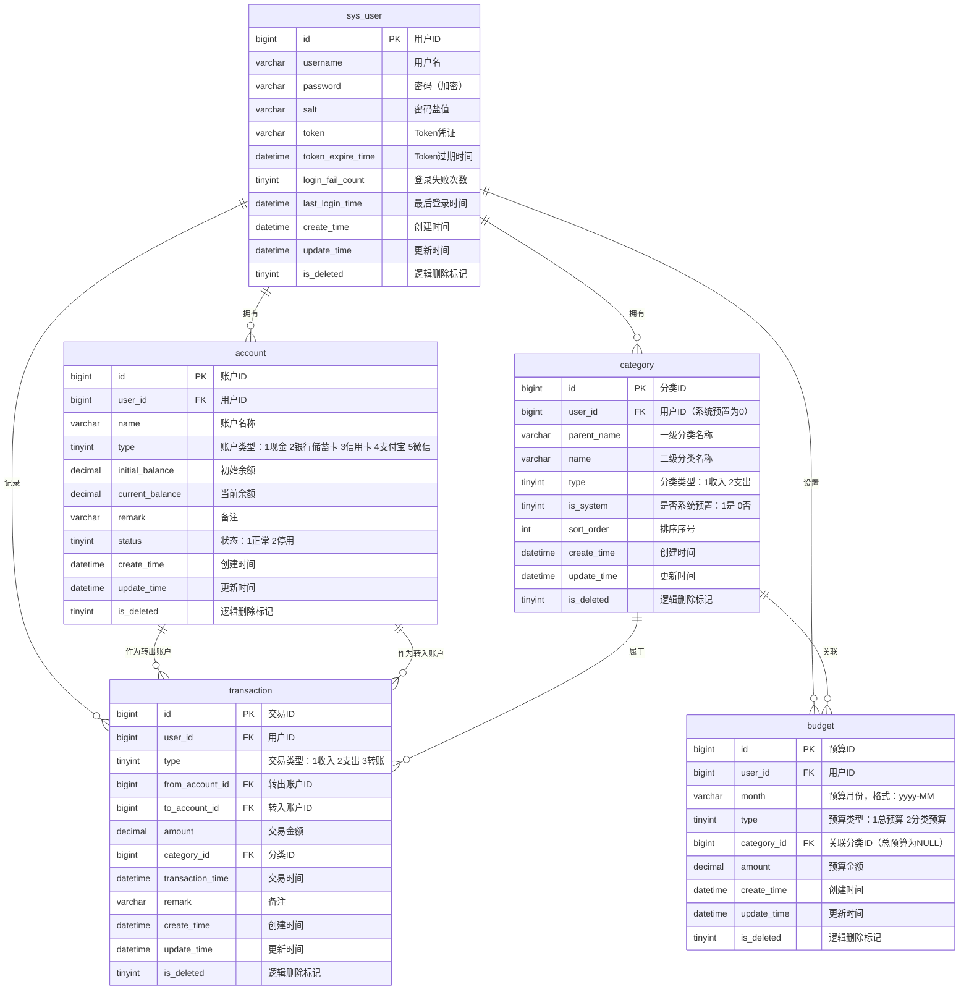

# 个人记账系统数据库设计文档

> 文档版本：v1.0
> 适用范围：mint-pab 个人记账系统

---

## 1. 文档信息

| 项目 | 说明 |
|------|------|
| **文档名称** | 个人记账系统数据库设计文档 |
| **文档版本** | v1.0 |
| **数据库类型** | MySQL 8.0+ |
| **存储引擎** | InnoDB |
| **字符集** | utf8mb4 |
| **排序规则** | utf8mb4_unicode_ci |
| **设计工具** | 手写 DDL |
| **编写日期** | 2026-05-05 |

---

## 2. 设计规范

### 2.1 命名规范

| 对象类型 | 命名规则 | 示例 |
|----------|----------|------|
| **表名** | 小写下划线命名，单数形式 | `sys_user`、`transaction` |
| **字段名** | 小写下划线命名 | `user_id`、`create_time` |
| **主键索引** | `pk_表名` | `pk_sys_user` |
| **唯一索引** | `uk_字段名` 或 `uk_表名_字段名` | `uk_username` |
| **普通索引** | `idx_字段名` 或 `idx_表名_字段名` | `idx_user_id` |
| **外键索引** | `fk_从表_主表_字段` | `fk_transaction_account` |

### 2.2 通用字段说明

所有数据表必须包含以下 4 个通用字段：

| 字段名 | 类型 | 是否为空 | 默认值 | 说明 |
|--------|------|----------|--------|------|
| `id` | `bigint unsigned` | 否 | 自增 | 主键，唯一标识，自增 |
| `create_time` | `datetime` | 否 | `CURRENT_TIMESTAMP` | 记录创建时间 |
| `update_time` | `datetime` | 否 | `CURRENT_TIMESTAMP` | 记录最后更新时间，更新时自动刷新 |
| `is_deleted` | `tinyint(1)` | 否 | `0` | 逻辑删除标记：0-未删除，1-已删除 |

### 2.3 数据类型规范

| 数据类别 | 推荐类型 | 说明 |
|----------|----------|------|
| **主键 ID** | `bigint unsigned` | 支持大数据量，自增主键 |
| **金额** | `decimal(12,2)` | 精确存储，支持最大 99,999,999.99 |
| **枚举值** | `tinyint` | 使用数字编码，节省空间，便于扩展 |
| **日期时间** | `datetime` | 精确到秒，统一使用 `CURRENT_TIMESTAMP` |
| **短文本** | `varchar(64)` / `varchar(128)` | 用户名、名称等 |
| **长文本** | `varchar(500)` | 备注、描述等 |
| **布尔值** | `tinyint(1)` | 0-否/假，1-是/真 |

---

## 3. 数据库 ER 图



---

## 4. 表结构设计

### 4.1 sys_user（用户表）

**表说明**：存储系统用户信息，包括登录凭证和 Token 认证信息。

#### DDL 建表语句

```sql
CREATE TABLE `sys_user` (
    `id` bigint unsigned NOT NULL AUTO_INCREMENT COMMENT '用户ID，主键',
    `username` varchar(64) NOT NULL COMMENT '用户名，唯一',
    `password` varchar(128) NOT NULL COMMENT '密码，加密存储',
    `salt` varchar(64) NOT NULL COMMENT '密码加密盐值',
    `token` varchar(512) DEFAULT NULL COMMENT 'Token凭证',
    `token_expire_time` datetime DEFAULT NULL COMMENT 'Token过期时间',
    `login_fail_count` tinyint unsigned NOT NULL DEFAULT '0' COMMENT '连续登录失败次数',
    `last_login_time` datetime DEFAULT NULL COMMENT '最后登录时间',
    `create_time` datetime NOT NULL DEFAULT CURRENT_TIMESTAMP COMMENT '创建时间',
    `update_time` datetime NOT NULL DEFAULT CURRENT_TIMESTAMP ON UPDATE CURRENT_TIMESTAMP COMMENT '更新时间',
    `is_deleted` tinyint(1) NOT NULL DEFAULT '0' COMMENT '逻辑删除标记：0-未删除，1-已删除',
    PRIMARY KEY (`id`),
    UNIQUE KEY `uk_username` (`username`) USING BTREE
) ENGINE=InnoDB DEFAULT CHARSET=utf8mb4 COLLATE=utf8mb4_unicode_ci COMMENT='用户表';
```

#### 字段说明

| 字段名 | 类型 | 是否为空 | 默认值 | 说明 |
|--------|------|----------|--------|------|
| `id` | `bigint unsigned` | 否 | 自增 | 主键，用户唯一标识 |
| `username` | `varchar(64)` | 否 | - | 用户名，3-20位字母/数字/下划线，全局唯一 |
| `password` | `varchar(128)` | 否 | - | 加密后的密码密文 |
| `salt` | `varchar(64)` | 否 | - | 密码加密盐值，增强安全性 |
| `token` | `varchar(512)` | 是 | NULL | 登录成功后颁发的 Token 凭证 |
| `token_expire_time` | `datetime` | 是 | NULL | Token 过期时间，过期后需重新登录 |
| `login_fail_count` | `tinyint unsigned` | 否 | 0 | 连续登录失败次数，达到阈值可锁定账户 |
| `last_login_time` | `datetime` | 是 | NULL | 最后一次成功登录的时间 |
| `create_time` | `datetime` | 否 | CURRENT_TIMESTAMP | 用户注册时间 |
| `update_time` | `datetime` | 否 | CURRENT_TIMESTAMP | 信息最后更新时间 |
| `is_deleted` | `tinyint(1)` | 否 | 0 | 逻辑删除标记：0-未删除，1-已删除 |

#### 索引设计

| 索引名 | 索引字段 | 索引类型 | 用途说明 |
|--------|----------|----------|----------|
| `PRIMARY` | `id` | 主键索引 | 唯一标识用户 |
| `uk_username` | `username` | 唯一索引 | 保证用户名全局唯一，用于登录查询 |

---

### 4.2 account（账户表）

**表说明**：存储用户的资产账户信息，每个账户归属一个用户，记录账户类型、余额及状态。

#### DDL 建表语句

```sql
CREATE TABLE `account` (
    `id` bigint unsigned NOT NULL AUTO_INCREMENT COMMENT '账户ID，主键',
    `user_id` bigint unsigned NOT NULL COMMENT '所属用户ID',
    `name` varchar(64) NOT NULL COMMENT '账户名称，同一用户下唯一',
    `type` tinyint unsigned NOT NULL COMMENT '账户类型：1现金 2银行储蓄卡 3信用卡 4支付宝 5微信',
    `initial_balance` decimal(12,2) NOT NULL DEFAULT '0.00' COMMENT '初始余额',
    `current_balance` decimal(12,2) NOT NULL DEFAULT '0.00' COMMENT '当前余额（实时计算）',
    `remark` varchar(200) DEFAULT NULL COMMENT '账户备注',
    `status` tinyint unsigned NOT NULL DEFAULT '1' COMMENT '账户状态：1正常 2停用',
    `create_time` datetime NOT NULL DEFAULT CURRENT_TIMESTAMP COMMENT '创建时间',
    `update_time` datetime NOT NULL DEFAULT CURRENT_TIMESTAMP ON UPDATE CURRENT_TIMESTAMP COMMENT '更新时间',
    `is_deleted` tinyint(1) NOT NULL DEFAULT '0' COMMENT '逻辑删除标记：0-未删除，1-已删除',
    PRIMARY KEY (`id`),
    UNIQUE KEY `uk_user_id_name` (`user_id`, `name`) USING BTREE,
    KEY `idx_user_id` (`user_id`) USING BTREE,
    KEY `idx_user_id_status` (`user_id`, `status`) USING BTREE,
    CONSTRAINT `fk_account_user` FOREIGN KEY (`user_id`) REFERENCES `sys_user` (`id`)
) ENGINE=InnoDB DEFAULT CHARSET=utf8mb4 COLLATE=utf8mb4_unicode_ci COMMENT='账户表';
```

#### 字段说明

| 字段名 | 类型 | 是否为空 | 默认值 | 说明 |
|--------|------|----------|--------|------|
| `id` | `bigint unsigned` | 否 | 自增 | 主键，账户唯一标识 |
| `user_id` | `bigint unsigned` | 否 | - | 外键，关联 sys_user.id |
| `name` | `varchar(64)` | 否 | - | 账户名称，同一用户下不可重复，2-30位 |
| `type` | `tinyint unsigned` | 否 | - | 账户类型：1现金、2银行储蓄卡、3信用卡、4支付宝、5微信 |
| `initial_balance` | `decimal(12,2)` | 否 | 0.00 | 账户初始余额，可正可负 |
| `current_balance` | `decimal(12,2)` | 否 | 0.00 | 当前余额，由初始余额和交易记录自动计算，不可直接修改 |
| `remark` | `varchar(200)` | 是 | NULL | 账户备注说明，0-200位 |
| `status` | `tinyint unsigned` | 否 | 1 | 账户状态：1正常、2停用。停用后不可用于新记账 |
| `create_time` | `datetime` | 否 | CURRENT_TIMESTAMP | 账户创建时间 |
| `update_time` | `datetime` | 否 | CURRENT_TIMESTAMP | 信息最后更新时间 |
| `is_deleted` | `tinyint(1)` | 否 | 0 | 逻辑删除标记：0-未删除，1-已删除 |

#### 索引设计

| 索引名 | 索引字段 | 索引类型 | 用途说明 |
|--------|----------|----------|----------|
| `PRIMARY` | `id` | 主键索引 | 唯一标识账户 |
| `uk_user_id_name` | `user_id`, `name` | 唯一索引 | 同一用户下账户名称不可重复 |
| `idx_user_id` | `user_id` | 普通索引 | 按用户查询账户列表 |
| `idx_user_id_status` | `user_id`, `status` | 普通索引 | 按用户和状态查询可用账户 |
| `fk_account_user` | `user_id` | 外键索引 | 关联 sys_user 表 |

---

### 4.3 category（交易分类表）

**表说明**：存储交易分类信息，采用两级分类结构（一级大类 + 二级子类），支持系统预置和用户自定义。

#### DDL 建表语句

```sql
CREATE TABLE `category` (
    `id` bigint unsigned NOT NULL AUTO_INCREMENT COMMENT '分类ID，主键',
    `user_id` bigint unsigned NOT NULL DEFAULT '0' COMMENT '所属用户ID，系统预置分类为0',
    `parent_name` varchar(64) NOT NULL COMMENT '一级分类名称',
    `name` varchar(64) NOT NULL COMMENT '二级分类名称',
    `type` tinyint unsigned NOT NULL COMMENT '分类类型：1收入 2支出',
    `is_system` tinyint(1) NOT NULL DEFAULT '0' COMMENT '是否系统预置：1是 0否',
    `sort_order` int unsigned NOT NULL DEFAULT '0' COMMENT '排序序号，升序排列',
    `create_time` datetime NOT NULL DEFAULT CURRENT_TIMESTAMP COMMENT '创建时间',
    `update_time` datetime NOT NULL DEFAULT CURRENT_TIMESTAMP ON UPDATE CURRENT_TIMESTAMP COMMENT '更新时间',
    `is_deleted` tinyint(1) NOT NULL DEFAULT '0' COMMENT '逻辑删除标记：0-未删除，1-已删除',
    PRIMARY KEY (`id`),
    UNIQUE KEY `uk_parent_name_name_type` (`parent_name`, `name`, `type`) USING BTREE,
    KEY `idx_user_id` (`user_id`) USING BTREE,
    KEY `idx_type` (`type`) USING BTREE,
    KEY `idx_is_system` (`is_system`) USING BTREE,
    KEY `idx_sort_order` (`sort_order`) USING BTREE
) ENGINE=InnoDB DEFAULT CHARSET=utf8mb4 COLLATE=utf8mb4_unicode_ci COMMENT='交易分类表';
```

#### 字段说明

| 字段名 | 类型 | 是否为空 | 默认值 | 说明 |
|--------|------|----------|--------|------|
| `id` | `bigint unsigned` | 否 | 自增 | 主键，分类唯一标识 |
| `user_id` | `bigint unsigned` | 否 | 0 | 所属用户ID，系统预置分类固定为 0 |
| `parent_name` | `varchar(64)` | 否 | - | 一级分类名称，2-20位 |
| `name` | `varchar(64)` | 否 | - | 二级分类名称，2-20位 |
| `type` | `tinyint unsigned` | 否 | - | 分类类型：1收入、2支出 |
| `is_system` | `tinyint(1)` | 否 | 0 | 是否系统预置：1是（不可删除）、0否（用户自定义） |
| `sort_order` | `int unsigned` | 否 | 0 | 排序序号，控制分类展示顺序 |
| `create_time` | `datetime` | 否 | CURRENT_TIMESTAMP | 分类创建时间 |
| `update_time` | `datetime` | 否 | CURRENT_TIMESTAMP | 信息最后更新时间 |
| `is_deleted` | `tinyint(1)` | 否 | 0 | 逻辑删除标记：0-未删除，1-已删除 |

#### 索引设计

| 索引名 | 索引字段 | 索引类型 | 用途说明 |
|--------|----------|----------|----------|
| `PRIMARY` | `id` | 主键索引 | 唯一标识分类 |
| `uk_parent_name_name_type` | `parent_name`, `name`, `type` | 唯一索引 | 同一类型下，一级+二级分类名称唯一 |
| `idx_user_id` | `user_id` | 普通索引 | 按用户查询分类列表 |
| `idx_type` | `type` | 普通索引 | 按收入/支出类型筛选 |
| `idx_is_system` | `is_system` | 普通索引 | 区分系统预置与用户自定义 |
| `idx_sort_order` | `sort_order` | 普通索引 | 按排序序号展示 |

---

### 4.4 transaction（交易记录表）

**表说明**：存储所有交易记录，包括收入、支出和转账三种类型。是系统的核心业务表。

#### DDL 建表语句

```sql
CREATE TABLE `transaction` (
    `id` bigint unsigned NOT NULL AUTO_INCREMENT COMMENT '交易ID，主键',
    `user_id` bigint unsigned NOT NULL COMMENT '所属用户ID',
    `type` tinyint unsigned NOT NULL COMMENT '交易类型：1收入 2支出 3转账',
    `from_account_id` bigint unsigned DEFAULT NULL COMMENT '转出账户ID，支出/转账时必填',
    `to_account_id` bigint unsigned DEFAULT NULL COMMENT '转入账户ID，收入/转账时必填',
    `amount` decimal(12,2) NOT NULL COMMENT '交易金额，必须大于0',
    `category_id` bigint unsigned NOT NULL COMMENT '交易分类ID',
    `transaction_time` datetime NOT NULL COMMENT '交易发生时间，精确到分钟',
    `remark` varchar(500) DEFAULT NULL COMMENT '交易备注，0-500位',
    `create_time` datetime NOT NULL DEFAULT CURRENT_TIMESTAMP COMMENT '创建时间',
    `update_time` datetime NOT NULL DEFAULT CURRENT_TIMESTAMP ON UPDATE CURRENT_TIMESTAMP COMMENT '更新时间',
    `is_deleted` tinyint(1) NOT NULL DEFAULT '0' COMMENT '逻辑删除标记：0-未删除，1-已删除',
    PRIMARY KEY (`id`),
    KEY `idx_user_id` (`user_id`) USING BTREE,
    KEY `idx_user_id_type` (`user_id`, `type`) USING BTREE,
    KEY `idx_user_id_transaction_time` (`user_id`, `transaction_time`) USING BTREE,
    KEY `idx_from_account_id` (`from_account_id`) USING BTREE,
    KEY `idx_to_account_id` (`to_account_id`) USING BTREE,
    KEY `idx_category_id` (`category_id`) USING BTREE,
    KEY `idx_user_id_month` (`user_id`, `transaction_time`) USING BTREE,
    CONSTRAINT `fk_transaction_user` FOREIGN KEY (`user_id`) REFERENCES `sys_user` (`id`),
    CONSTRAINT `fk_transaction_from_account` FOREIGN KEY (`from_account_id`) REFERENCES `account` (`id`),
    CONSTRAINT `fk_transaction_to_account` FOREIGN KEY (`to_account_id`) REFERENCES `account` (`id`),
    CONSTRAINT `fk_transaction_category` FOREIGN KEY (`category_id`) REFERENCES `category` (`id`)
) ENGINE=InnoDB DEFAULT CHARSET=utf8mb4 COLLATE=utf8mb4_unicode_ci COMMENT='交易记录表';
```

#### 字段说明

| 字段名 | 类型 | 是否为空 | 默认值 | 说明 |
|--------|------|----------|--------|------|
| `id` | `bigint unsigned` | 否 | 自增 | 主键，交易唯一标识 |
| `user_id` | `bigint unsigned` | 否 | - | 外键，关联 sys_user.id |
| `type` | `tinyint unsigned` | 否 | - | 交易类型：1收入、2支出、3转账 |
| `from_account_id` | `bigint unsigned` | 是 | NULL | 转出账户ID，支出和转账时必填 |
| `to_account_id` | `bigint unsigned` | 是 | NULL | 转入账户ID，收入和转账时必填 |
| `amount` | `decimal(12,2)` | 否 | - | 交易金额，必须大于 0 |
| `category_id` | `bigint unsigned` | 否 | - | 外键，关联交易分类 |
| `transaction_time` | `datetime` | 否 | - | 交易发生时间，精确到分钟 |
| `remark` | `varchar(500)` | 是 | NULL | 交易备注说明 |
| `create_time` | `datetime` | 否 | CURRENT_TIMESTAMP | 交易记录创建时间 |
| `update_time` | `datetime` | 否 | CURRENT_TIMESTAMP | 交易记录最后更新时间 |
| `is_deleted` | `tinyint(1)` | 否 | 0 | 逻辑删除标记：0-未删除，1-已删除 |

#### 索引设计

| 索引名 | 索引字段 | 索引类型 | 用途说明 |
|--------|----------|----------|----------|
| `PRIMARY` | `id` | 主键索引 | 唯一标识交易记录 |
| `idx_user_id` | `user_id` | 普通索引 | 按用户查询交易列表 |
| `idx_user_id_type` | `user_id`, `type` | 普通索引 | 按用户和交易类型筛选 |
| `idx_user_id_transaction_time` | `user_id`, `transaction_time` | 普通索引 | 按用户和交易时间倒序查询（流水列表默认排序） |
| `idx_user_id_month` | `user_id`, `transaction_time` | 普通索引 | 按用户和月份范围查询（报表统计） |
| `idx_from_account_id` | `from_account_id` | 普通索引 | 按转出账户查询 |
| `idx_to_account_id` | `to_account_id` | 普通索引 | 按转入账户查询 |
| `idx_category_id` | `category_id` | 普通索引 | 按分类查询交易 |
| `fk_transaction_user` | `user_id` | 外键索引 | 关联 sys_user 表 |
| `fk_transaction_from_account` | `from_account_id` | 外键索引 | 关联 account 表（转出） |
| `fk_transaction_to_account` | `to_account_id` | 外键索引 | 关联 account 表（转入） |
| `fk_transaction_category` | `category_id` | 外键索引 | 关联 category 表 |

---

### 4.5 budget（预算表）

**表说明**：存储用户的月度预算设置，支持总预算和分类预算两种类型。预算已用金额由系统根据交易记录实时计算，不存储在表中。

#### DDL 建表语句

```sql
CREATE TABLE `budget` (
    `id` bigint unsigned NOT NULL AUTO_INCREMENT COMMENT '预算ID，主键',
    `user_id` bigint unsigned NOT NULL COMMENT '所属用户ID',
    `month` varchar(7) NOT NULL COMMENT '预算月份，格式：yyyy-MM',
    `type` tinyint unsigned NOT NULL COMMENT '预算类型：1总预算 2分类预算',
    `category_id` bigint unsigned DEFAULT NULL COMMENT '关联分类ID，分类预算时必填，总预算为NULL',
    `amount` decimal(12,2) NOT NULL COMMENT '预算金额，必须大于0',
    `create_time` datetime NOT NULL DEFAULT CURRENT_TIMESTAMP COMMENT '创建时间',
    `update_time` datetime NOT NULL DEFAULT CURRENT_TIMESTAMP ON UPDATE CURRENT_TIMESTAMP COMMENT '更新时间',
    `is_deleted` tinyint(1) NOT NULL DEFAULT '0' COMMENT '逻辑删除标记：0-未删除，1-已删除',
    PRIMARY KEY (`id`),
    UNIQUE KEY `uk_user_month_type_category` (`user_id`, `month`, `type`, `category_id`) USING BTREE,
    KEY `idx_user_id_month` (`user_id`, `month`) USING BTREE,
    KEY `idx_user_id` (`user_id`) USING BTREE,
    KEY `idx_category_id` (`category_id`) USING BTREE,
    CONSTRAINT `fk_budget_user` FOREIGN KEY (`user_id`) REFERENCES `sys_user` (`id`),
    CONSTRAINT `fk_budget_category` FOREIGN KEY (`category_id`) REFERENCES `category` (`id`)
) ENGINE=InnoDB DEFAULT CHARSET=utf8mb4 COLLATE=utf8mb4_unicode_ci COMMENT='预算表';
```

#### 字段说明

| 字段名 | 类型 | 是否为空 | 默认值 | 说明 |
|--------|------|----------|--------|------|
| `id` | `bigint unsigned` | 否 | 自增 | 主键，预算唯一标识 |
| `user_id` | `bigint unsigned` | 否 | - | 外键，关联 sys_user.id |
| `month` | `varchar(7)` | 否 | - | 预算月份，格式：yyyy-MM，如 2026-05 |
| `type` | `tinyint unsigned` | 否 | - | 预算类型：1总预算、2分类预算 |
| `category_id` | `bigint unsigned` | 是 | NULL | 关联分类ID，分类预算时必填，总预算时为 NULL |
| `amount` | `decimal(12,2)` | 否 | - | 预算金额，必须大于 0 |
| `create_time` | `datetime` | 否 | CURRENT_TIMESTAMP | 预算创建时间 |
| `update_time` | `datetime` | 否 | CURRENT_TIMESTAMP | 预算最后更新时间 |
| `is_deleted` | `tinyint(1)` | 否 | 0 | 逻辑删除标记：0-未删除，1-已删除 |

#### 索引设计

| 索引名 | 索引字段 | 索引类型 | 用途说明 |
|--------|----------|----------|----------|
| `PRIMARY` | `id` | 主键索引 | 唯一标识预算 |
| `uk_user_month_type_category` | `user_id`, `month`, `type`, `category_id` | 唯一索引 | 同一用户、同一月份、同一类型、同一分类只能有一条预算记录 |
| `idx_user_id_month` | `user_id`, `month` | 普通索引 | 按用户和月份查询预算 |
| `idx_user_id` | `user_id` | 普通索引 | 按用户查询所有预算 |
| `idx_category_id` | `category_id` | 普通索引 | 按分类查询关联预算 |
| `fk_budget_user` | `user_id` | 外键索引 | 关联 sys_user 表 |
| `fk_budget_category` | `category_id` | 外键索引 | 关联 category 表 |

---

## 5. 数据字典

### 5.1 账户类型（account.type）

| 编码 | 含义 | 说明 |
|------|------|------|
| `1` | 现金 | 手持现金 |
| `2` | 银行储蓄卡 | 借记卡、储蓄卡 |
| `3` | 信用卡 | 信用卡，余额可为负 |
| `4` | 支付宝 | 支付宝余额 |
| `5` | 微信 | 微信零钱 |

### 5.2 账户状态（account.status）

| 编码 | 含义 | 说明 |
|------|------|------|
| `1` | 正常 | 账户可正常使用 |
| `2` | 停用 | 账户不可用于新记账，历史交易仍可查询 |

### 5.3 交易类型（transaction.type）

| 编码 | 含义 | 说明 |
|------|------|------|
| `1` | 收入 | 资金流入，增加账户余额 |
| `2` | 支出 | 资金流出，减少账户余额 |
| `3` | 转账 | 账户间资金转移，转出减少、转入增加 |

### 5.4 分类类型（category.type）

| 编码 | 含义 | 说明 |
|------|------|------|
| `1` | 收入 | 适用于收入交易 |
| `2` | 支出 | 适用于支出交易 |

### 5.5 是否系统预置（category.is_system）

| 编码 | 含义 | 说明 |
|------|------|------|
| `0` | 否 | 用户自定义分类，可删除 |
| `1` | 是 | 系统预置分类，不可删除 |

### 5.6 预算类型（budget.type）

| 编码 | 含义 | 说明 |
|------|------|------|
| `1` | 总预算 | 月度总支出预算上限 |
| `2` | 分类预算 | 某一分类的支出预算上限 |

### 5.7 逻辑删除标记（通用字段 is_deleted）

| 编码 | 含义 | 说明 |
|------|------|------|
| `0` | 未删除 | 数据正常有效 |
| `1` | 已删除 | 数据已逻辑删除，查询时默认过滤 |

---

## 6. 初始化数据

### 6.1 系统预置交易分类

系统初始化时自动插入以下预置分类，`user_id` 固定为 `0`，`is_system` 固定为 `1`。

```sql
-- 收入分类
INSERT INTO `category` (`user_id`, `parent_name`, `name`, `type`, `is_system`, `sort_order`) VALUES
(0, '收入', '工资', 1, 1, 1),
(0, '收入', '奖金', 1, 1, 2),
(0, '收入', '投资收益', 1, 1, 3),
(0, '收入', '兼职', 1, 1, 4),
(0, '收入', '红包', 1, 1, 5);

-- 支出分类
INSERT INTO `category` (`user_id`, `parent_name`, `name`, `type`, `is_system`, `sort_order`) VALUES
(0, '餐饮', '外卖', 2, 1, 10),
(0, '餐饮', '堂食', 2, 1, 11),
(0, '餐饮', '食材', 2, 1, 12),
(0, '餐饮', '零食饮料', 2, 1, 13),
(0, '交通', '公共交通', 2, 1, 20),
(0, '交通', '打车', 2, 1, 21),
(0, '交通', '加油', 2, 1, 22),
(0, '交通', '停车', 2, 1, 23),
(0, '购物', '服饰鞋包', 2, 1, 30),
(0, '购物', '日用百货', 2, 1, 31),
(0, '购物', '数码电子', 2, 1, 32),
(0, '居住', '房租', 2, 1, 40),
(0, '居住', '水电煤', 2, 1, 41),
(0, '居住', '物业', 2, 1, 42),
(0, '居住', '维修', 2, 1, 43),
(0, '娱乐', '电影演出', 2, 1, 50),
(0, '娱乐', '游戏', 2, 1, 51),
(0, '娱乐', '旅游', 2, 1, 52),
(0, '娱乐', '会员订阅', 2, 1, 53),
(0, '医疗', '药品', 2, 1, 60),
(0, '医疗', '诊疗', 2, 1, 61),
(0, '医疗', '体检', 2, 1, 62),
(0, '教育', '书籍', 2, 1, 70),
(0, '教育', '课程培训', 2, 1, 71),
(0, '教育', '考试', 2, 1, 72),
(0, '转账', '账户间转账', 2, 1, 99);
```

---

## 7. 设计说明

### 7.1 逻辑删除策略

**策略说明**：

- 所有业务表均通过 `is_deleted` 字段实现逻辑删除，不执行物理删除操作。
- `is_deleted = 0` 表示数据有效，`is_deleted = 1` 表示数据已删除。
- 所有业务查询默认增加 `is_deleted = 0` 条件过滤已删除数据。
- 删除操作实际为 UPDATE 语句：将 `is_deleted` 置为 `1`。

**各表删除约束**：

| 表名 | 删除约束 |
|------|----------|
| `sys_user` | 单人系统，无删除需求 |
| `account` | 存在关联交易记录时禁止删除；系统预设账户禁止删除 |
| `category` | 存在关联交易记录时禁止删除；系统预置分类禁止删除 |
| `transaction` | 支持逻辑删除，删除后自动回滚相关账户余额 |
| `budget` | 支持逻辑删除，删除后不再参与预算监控 |

### 7.2 余额计算策略说明

**账户当前余额计算公式**：

```
current_balance = initial_balance + SUM(收入金额) - SUM(支出金额) - SUM(转出金额) + SUM(转入金额)
```

**计算规则**：

1. **收入交易**：`to_account_id` 对应账户的 `current_balance` 增加 `amount`
2. **支出交易**：`from_account_id` 对应账户的 `current_balance` 减少 `amount`
3. **转账交易**：`from_account_id` 对应账户减少 `amount`，`to_account_id` 对应账户增加 `amount`
4. **交易编辑**：先回滚原交易对余额的影响，再应用新交易对余额的影响
5. **交易删除**：回滚该交易对余额的影响

**性能优化建议**：

- 交易记录新增/编辑/删除时，通过事务保证交易记录和账户余额的一致性更新
- 避免频繁全量计算余额，采用增量更新方式
- 报表统计涉及历史数据时，可按月份进行预聚合，提升查询性能

### 7.3 预算已用金额计算说明

**预算已用金额不存储在 budget 表中，由系统根据交易记录实时计算。**

**计算规则**：

1. **总预算已用金额**：

```sql
SELECT SUM(amount) FROM transaction
WHERE user_id = ?
  AND type = 2          -- 支出类型
  AND is_deleted = 0
  AND DATE_FORMAT(transaction_time, '%Y-%m') = ?   -- 目标月份
```

2. **分类预算已用金额**：

```sql
SELECT SUM(t.amount) FROM transaction t
JOIN category c ON t.category_id = c.id
WHERE t.user_id = ?
  AND t.type = 2        -- 支出类型
  AND t.is_deleted = 0
  AND DATE_FORMAT(t.transaction_time, '%Y-%m') = ?   -- 目标月份
  AND c.parent_name = (SELECT parent_name FROM category WHERE id = ?)  -- 对应一级分类
```

**预算执行率计算**：

```
执行率 = (已用金额 / 预算金额) × 100%
```

**预警阈值**：

| 执行率范围 | 状态 | 展示样式 |
|-----------|------|----------|
| < 80% | 正常 | 绿色进度条 |
| >= 80% 且 < 100% | 接近预算 | 黄色提醒 |
| >= 100% | 已超预算 | 红色预警 |

**性能优化建议**：

- 首页预算执行率展示属于高频查询，可引入 Redis 缓存当日计算结果
- 缓存 Key 设计：`monit:budget:{userId}:{month}`
- 记账操作后异步刷新缓存，或设置合理的缓存过期时间（如 5 分钟）
