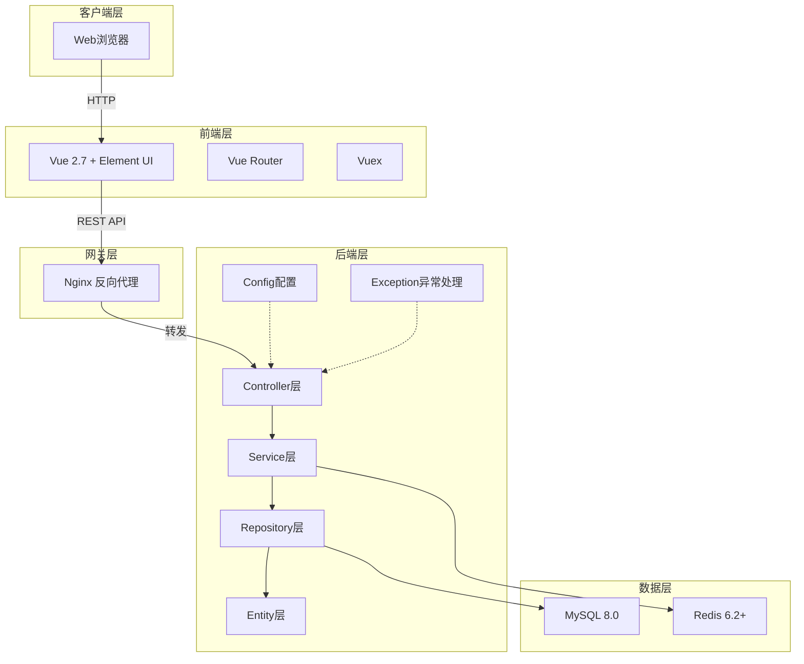
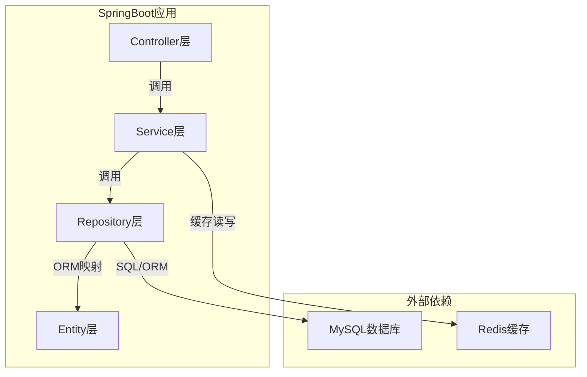
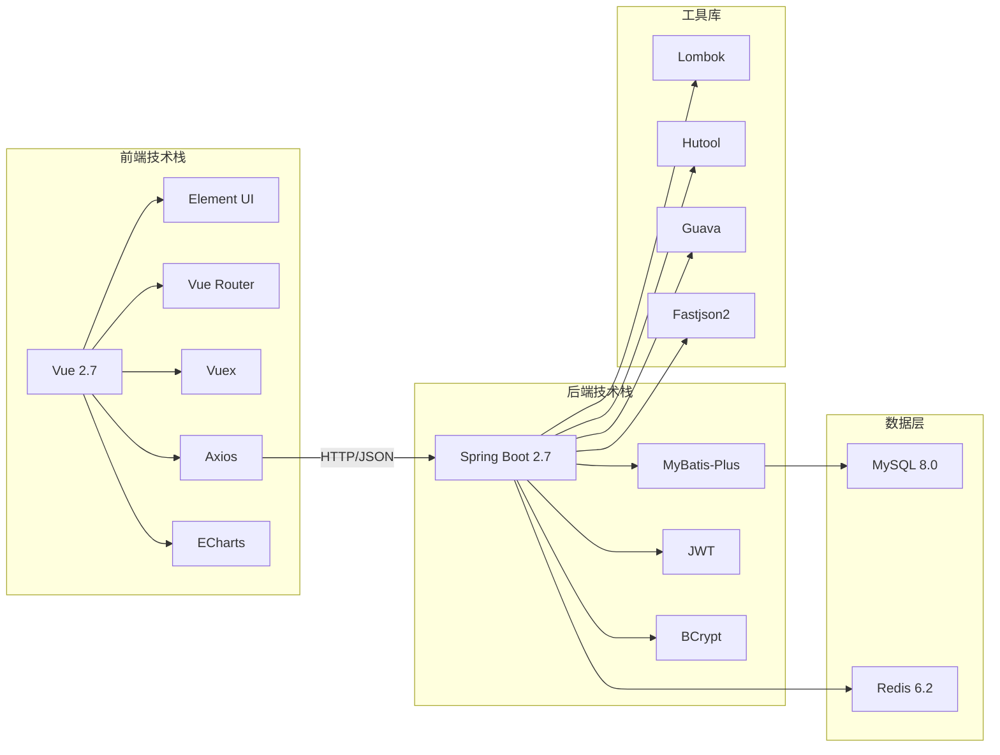
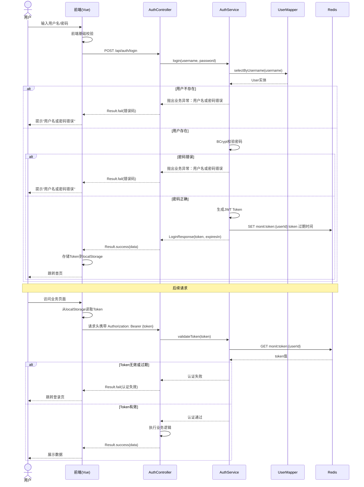
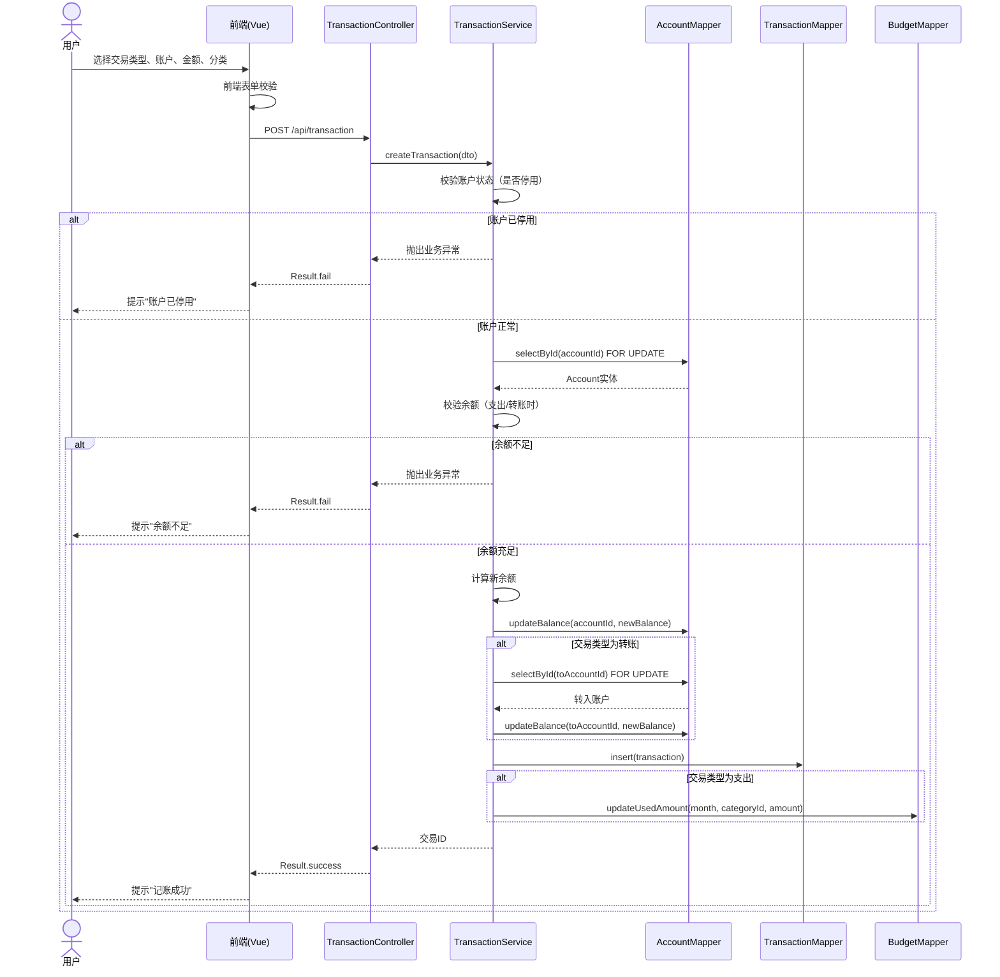
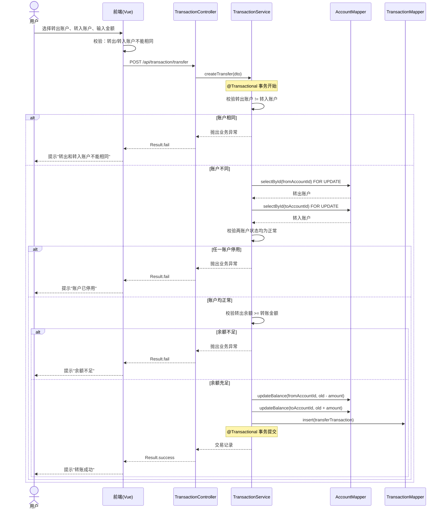
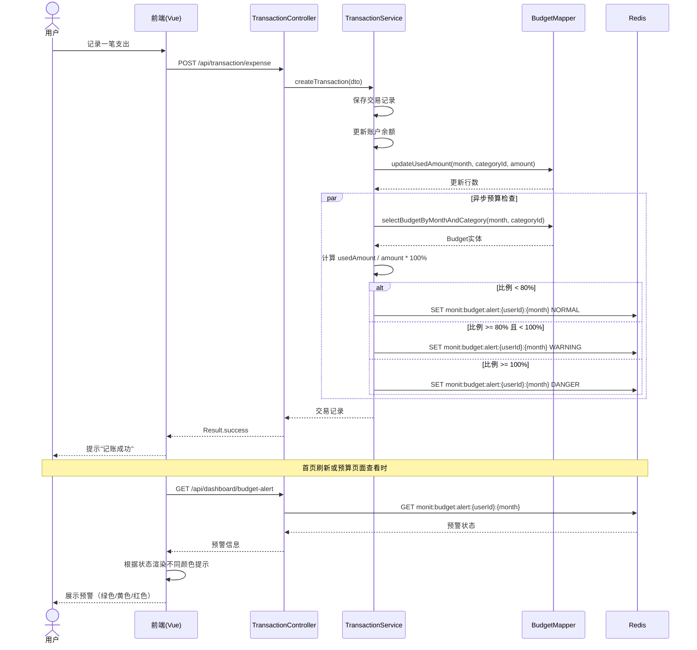
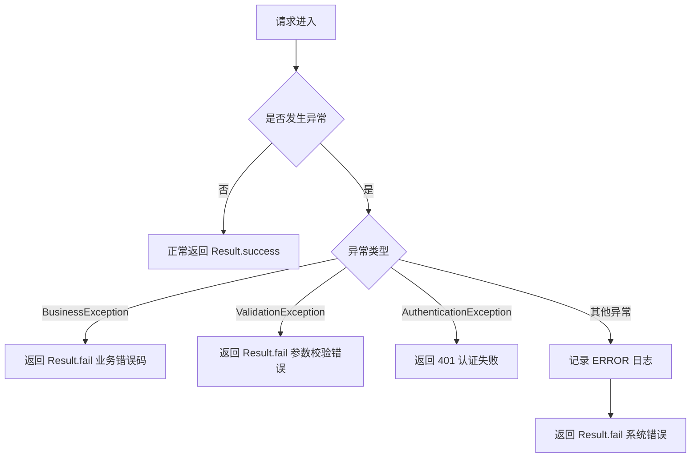
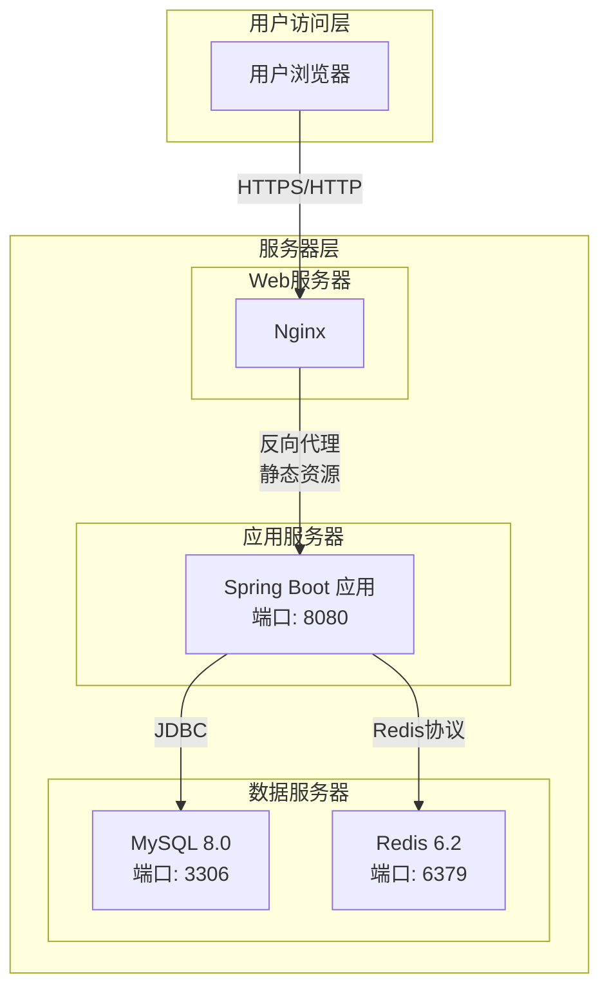

# 个人记账系统设计文档

> 文档版本：v1.0
> 适用范围：mint-pab 个人记账系统
> 编写日期：2026-05-05
> 作者：开发团队

---

## 目录

1. [文档信息](#1-文档信息)
2. [系统概述](#2-系统概述)
3. [系统架构设计](#3-系统架构设计)
4. [模块划分](#4-模块划分)
5. [技术选型说明](#5-技术选型说明)
6. [核心流程设计](#6-核心流程设计)
7. [安全设计](#7-安全设计)
8. [缓存设计](#8-缓存设计)
9. [异常处理设计](#9-异常处理设计)
10. [部署架构](#10-部署架构)

---

## 1. 文档信息

### 1.1 文档版本控制

| 版本 | 日期       | 修订内容 | 修订人   |
| ---- | ---------- | -------- | -------- |
| v1.0 | 2026-05-05 | 初始版本 | 开发团队 |

### 1.2 参考文档

| 文档名称             | 路径                                 | 说明                |
| -------------------- | ------------------------------------ | ------------------- |
| 个人记账系统需求文档 | docs/requirement/个人记账系统需求.md | 产品需求文档（PRD） |
| 项目技术栈规范       | AGENTS.md                            | 技术选型与使用规范  |

### 1.3 术语定义

| 术语     | 说明                                             |
| -------- | ------------------------------------------------ |
| 单式记账 | 每笔交易只在一个账户中记录增加或减少             |
| Token    | 用户登录后系统颁发的加密凭证，用于身份认证       |
| 逻辑删除 | 通过状态字段标记记录已删除，数据仍保留在数据库中 |
| CRUD     | Create / Read / Update / Delete，即增删改查操作  |

---

## 2. 系统概述

### 2.1 系统背景

mint-pab 是一款面向个人用户的财务管理工具，采用前后端分离架构，帮助用户记录日常收支、管理个人资产、制定并跟踪预算计划，通过可视化报表直观了解个人财务状况。

### 2.2 设计目标

| 目标     | 说明                                 |
| -------- | ------------------------------------ |
| 便捷性   | 记账操作在3步以内完成核心信息录入    |
| 准确性   | 交易记录与账户余额始终保持一致       |
| 实时性   | 首页加载时间不超过2秒，数据实时刷新  |
| 安全性   | 密码加密存储，Token认证，防暴力破解  |
| 可扩展性 | 架构清晰，便于后续功能扩展和版本迭代 |

### 2.3 设计原则

- **高内聚低耦合**：各模块职责单一，模块间通过接口通信
- **分层架构**：Controller / Service / Repository / Entity 严格分层
- **统一封装**：接口返回统一 Result 对象，异常统一处理
- **性能优先**：合理使用缓存，数据库查询使用索引
- **数据一致性**：核心业务使用数据库事务保障数据一致性

---

## 3. 系统架构设计

### 3.1 整体架构图



### 3.2 前后端分离架构说明

系统采用前后端分离架构，前后端通过标准的 HTTP REST API 进行通信，数据交换格式为 JSON。

| 层级 | 技术栈               | 职责                                       |
| ---- | -------------------- | ------------------------------------------ |
| 前端 | Vue 2.7 + Element UI | 用户界面渲染、交互逻辑、路由管理、状态管理 |
| 网关 | Nginx                | 静态资源托管、反向代理、负载均衡（预留）   |
| 后端 | Spring Boot 2.7.x    | 业务逻辑处理、数据持久化、安全认证         |
| 数据 | MySQL + Redis        | 关系型数据持久化 + 缓存加速                |

### 3.3 分层架构

后端采用经典的分层架构模式，各层职责清晰、单向依赖：



#### 各层职责说明

| 分层                 | 职责                                             | 规范                       |
| -------------------- | ------------------------------------------------ | -------------------------- |
| **Controller** | 接收 HTTP 请求、参数校验、调用 Service、返回响应 | 不直接操作数据库           |
| **Service**    | 业务逻辑编排、事务管理、数据校验                 | 不直接暴露给外部           |
| **Repository** | 数据访问、CRUD 操作、ORM 映射                    | 仅被 Service 调用          |
| **Entity**     | 数据实体定义、与数据库表映射                     | 无业务逻辑                 |
| **DTO**        | 数据传输对象，用于层间数据传递                   | 避免直接暴露 Entity        |
| **Config**     | 框架配置、Bean 注册                              | 集中管理配置               |
| **Exception**  | 全局异常捕获、统一错误处理                       | 使用 @RestControllerAdvice |

---

## 4. 模块划分

### 4.1 后端模块结构（包结构设计）

```
com.github.allyangcn.mintpab
├── MintPabApplication.java          # 主启动类
├── config                           # 配置类
│   ├── WebConfig.java               # Web 配置
│   ├── RedisConfig.java             # Redis 配置
│   ├── MybatisPlusConfig.java       # MyBatis-Plus 配置
│   └── SecurityConfig.java          # 安全配置
├── controller                       # 控制器层
│   ├── AuthController.java          # 认证接口
│   ├── AccountController.java       # 账户管理接口
│   ├── TransactionController.java   # 交易记账接口
│   ├── CategoryController.java      # 分类管理接口
│   ├── BudgetController.java        # 预算管理接口
│   ├── ReportController.java        # 财务报表接口
│   └── DashboardController.java     # 首页工作台接口
├── service                          # 业务逻辑层
│   ├── AuthService.java             # 认证服务
│   ├── AccountService.java          # 账户服务
│   ├── TransactionService.java      # 交易服务
│   ├── CategoryService.java         # 分类服务
│   ├── BudgetService.java           # 预算服务
│   ├── ReportService.java           # 报表服务
│   └── DashboardService.java        # 工作台服务
├── repository                       # 数据访问层
│   ├── AccountMapper.java           # 账户数据访问
│   ├── TransactionMapper.java       # 交易数据访问
│   ├── CategoryMapper.java          # 分类数据访问
│   ├── BudgetMapper.java            # 预算数据访问
│   └── UserMapper.java              # 用户数据访问
├── entity                           # 实体类
│   ├── User.java                    # 用户实体
│   ├── Account.java                 # 账户实体
│   ├── Transaction.java             # 交易实体
│   ├── Category.java                # 分类实体
│   └── Budget.java                  # 预算实体
├── dto                              # 数据传输对象
│   ├── Result.java                  # 统一响应封装
│   ├── PageResult.java              # 分页响应封装
│   ├── LoginRequest.java            # 登录请求DTO
│   ├── LoginResponse.java           # 登录响应DTO
│   ├── AccountDTO.java              # 账户DTO
│   ├── TransactionDTO.java          # 交易DTO
│   ├── CategoryDTO.java             # 分类DTO
│   ├── BudgetDTO.java               # 预算DTO
│   └── ReportDTO.java               # 报表DTO
├── vo                               # 视图对象
│   ├── DashboardVO.java             # 工作台数据VO
│   ├── BalanceSheetVO.java          # 资产负债表VO
│   ├── IncomeExpenseVO.java         # 收支表VO
│   └── CashFlowVO.java              # 现金流量表VO
├── exception                        # 异常处理
│   ├── GlobalExceptionHandler.java  # 全局异常处理器
│   ├── BusinessException.java       # 业务异常
│   └── ErrorCode.java               # 错误码枚举
├── interceptor                      # 拦截器
│   └── AuthInterceptor.java         # Token认证拦截器
├── util                             # 工具类
│   ├── JwtUtil.java                 # JWT工具
│   ├── PasswordUtil.java            # 密码加密工具
│   └── DateUtil.java                # 日期工具
└── enums                            # 枚举定义
    ├── AccountType.java             # 账户类型枚举
    ├── AccountStatus.java           # 账户状态枚举
    ├── TransactionType.java         # 交易类型枚举
    ├── CategoryType.java            # 分类类型枚举
    └── BudgetType.java              # 预算类型枚举
```

### 4.2 前端模块结构

```
mint-pab-frontend/
├── public/                          # 静态公共资源
│   └── index.html
├── src/
│   ├── api/                         # API 接口封装
│   │   ├── auth.js                  # 认证接口
│   │   ├── account.js               # 账户接口
│   │   ├── transaction.js           # 交易接口
│   │   ├── category.js              # 分类接口
│   │   ├── budget.js                # 预算接口
│   │   ├── report.js                # 报表接口
│   │   └── dashboard.js             # 工作台接口
│   ├── assets/                      # 静态资源
│   │   ├── images/
│   │   └── styles/
│   │       └── variables.scss       # 主题变量
│   ├── components/                  # 公共组件
│   │   ├── QuickRecord.vue          # 快速记账组件
│   │   ├── FinancialSummary.vue     # 财务摘要组件
│   │   ├── BudgetAlert.vue          # 预算预警组件
│   │   └── ChartPanel.vue           # 图表面板组件
│   ├── views/                       # 页面组件
│   │   ├── Login.vue                # 登录页
│   │   ├── Dashboard.vue            # 首页工作台
│   │   ├── AccountManage.vue        # 账户管理
│   │   ├── TransactionList.vue      # 流水查询
│   │   ├── TransactionRecord.vue    # 记账页面
│   │   ├── CategoryManage.vue       # 分类管理
│   │   ├── BudgetManage.vue         # 预算管理
│   │   └── ReportView.vue           # 财务报表
│   ├── router/                      # 路由配置
│   │   └── index.js                 # 路由定义
│   ├── store/                       # Vuex 状态管理
│   │   ├── index.js                 # Store 入口
│   │   ├── modules/
│   │   │   ├── user.js              # 用户状态
│   │   │   └── app.js               # 应用状态
│   │   └── getters.js               # Getters
│   ├── utils/                       # 工具函数
│   │   ├── request.js               # Axios 封装
│   │   ├── auth.js                  # Token 管理
│   │   ├── validate.js              # 表单校验
│   │   └── format.js                # 格式化工具
│   ├── App.vue                      # 根组件
│   └── main.js                      # 入口文件
├── package.json
└── vue.config.js
```

### 4.3 各模块职责说明

| 模块                 | 职责                                         | 对应后端Controller    |
| -------------------- | -------------------------------------------- | --------------------- |
| **安全与认证** | 用户密码登录、Token 颁发与校验、登录状态管理 | AuthController        |
| **账户管理**   | 账户 CRUD、停用/启用、余额计算               | AccountController     |
| **交易记账**   | 收入/支出/转账记录、编辑、删除、余额联动     | TransactionController |
| **分类管理**   | 两级分类体系、系统预置分类、自定义分类       | CategoryController    |
| **预算管理**   | 月度总预算、分类子预算、预算执行监控         | BudgetController      |
| **流水查询**   | 多条件组合查询、分页展示、数据导出           | TransactionController |
| **财务报表**   | 资产负债表、收支表、现金流量表生成           | ReportController      |
| **首页工作台** | 快速记账入口、财务摘要看板、预算提醒         | DashboardController   |

---

## 5. 技术选型说明

### 5.1 后端技术选型

| 技术组件               | 版本                   | 选型理由                                            |
| ---------------------- | ---------------------- | --------------------------------------------------- |
| **Maven**        | 3.6+                   | 行业标准构建工具，依赖管理成熟，插件生态丰富        |
| **Java 8**       | 1.8.0_201+             | 长期稳定支持版本，Lambda 和 Stream API 提升开发效率 |
| **Spring Boot**  | 2.7.x                  | 开箱即用的微服务框架，自动配置，降低开发复杂度      |
| **MyBatis-Plus** | 3.5.x                  | 简化 CRUD 操作，支持代码生成，提升开发效率          |
| **MySQL**        | 8.0+                   | 关系型数据库，支持复杂查询，社区成熟，免费开源      |
| **HikariCP**     | 与 Spring Boot 集成    | 性能最优的 JDBC 连接池，连接创建和回收高效          |
| **Redis**        | 6.2+                   | 高性能缓存数据库，支持会话管理和热点数据缓存        |
| **Lombok**       | 1.18.30+               | 通过注解减少样板代码，提升开发效率和可读性          |
| **Hutool**       | 5.8.x                  | 国产工具库，覆盖日期、字符串、文件等常用操作        |
| **Guava**        | 32.1.x                 | Google 工具库，提供本地缓存、集合工具、限流等能力   |
| **Fastjson2**    | 2.0.43                 | 阿里巴巴 JSON 库，高性能序列化/反序列化             |
| **JWT**          | 0.11.x                 | 无状态的 Token 认证方案，适合前后端分离架构         |
| **BCrypt**       | spring-security-crypto | 安全的密码哈希算法，自带盐值，抗彩虹表攻击          |

### 5.2 前端技术选型

| 技术组件             | 版本   | 选型理由                                       |
| -------------------- | ------ | ---------------------------------------------- |
| **Vue**        | 2.7.x  | 成熟稳定的前端框架，响应式数据绑定，组件化开发 |
| **Vue Router** | 3.5.x  | 官方路由管理，支持嵌套路由和路由守卫           |
| **Vuex**       | 3.6.x  | 官方状态管理，集中管理应用状态                 |
| **Element UI** | 2.15.x | 成熟的 Vue 2 UI 组件库，组件丰富，文档完善     |
| **Axios**      | 1.6.x  | 基于 Promise 的 HTTP 客户端，拦截器支持完善    |
| **ECharts**    | 5.4.x  | 百度开源图表库，支持多种图表类型，可定制性强   |
| **xlsx**       | 0.18.x | 前端 Excel 导出库，支持浏览器端生成文件        |
| **jsPDF**      | 2.5.x  | 前端 PDF 导出库，支持表格和文本生成            |

### 5.3 技术集成关系



---

## 6. 核心流程设计

### 6.1 用户认证流程



### 6.2 记账核心流程



### 6.3 转账事务流程



### 6.4 预算预警流程



---

## 7. 安全设计

### 7.1 认证机制设计

系统采用基于 JWT（JSON Web Token）的无状态认证机制：

| 设计要点            | 说明                                                        |
| ------------------- | ----------------------------------------------------------- |
| **密码存储**  | 使用 BCrypt 算法对密码进行哈希加密，自带随机盐值            |
| **Token生成** | 登录成功后生成 JWT Token，包含用户ID和过期时间              |
| **Token存储** | 服务端 Redis 存储 Token 副本，支持主动失效                  |
| **Token传递** | 前端通过 HTTP Header `Authorization: Bearer {token}` 传递 |
| **Token过期** | 设置合理的过期时间（如 7 天），过期后需重新登录             |

**JWT Token 结构：**

```
Header:    { "alg": "HS256", "typ": "JWT" }
Payload:   { "userId": "xxx", "username": "xxx", "exp": 1234567890 }
Signature: HMACSHA256(base64UrlEncode(header) + "." + base64UrlEncode(payload), secret)
```

### 7.2 数据传输安全

| 安全措施           | 说明                                         |
| ------------------ | -------------------------------------------- |
| **HTTPS**    | 生产环境强制使用 HTTPS 协议，加密传输通道    |
| **CORS**     | 配置跨域白名单，限制非授权域名访问           |
| **XSS防护**  | 前端输入过滤，后端输出转义                   |
| **CSRF防护** | 使用 Token 认证天然防御 CSRF，无需额外 Token |

### 7.3 防暴力破解

| 措施                   | 实现方式                                              |
| ---------------------- | ----------------------------------------------------- |
| **登录失败限制** | Redis 记录登录失败次数，连续失败 5 次锁定账户 30 分钟 |
| **验证码**       | 预留验证码接口，高频率登录时启用图形验证码            |
| **密码强度校验** | 密码长度 6-20 位，必须包含字母和数字                  |
| **日志审计**     | 记录所有登录尝试日志，便于安全审计                    |

**登录失败计数 Redis Key 设计：**

```
monit:login:fail:{username}  ->  失败次数（TTL: 30分钟）
monit:login:lock:{username}  ->  锁定标记（TTL: 30分钟）
```

---

## 8. 缓存设计

### 8.1 缓存策略

系统采用多级缓存策略，平衡数据一致性和访问性能：

| 缓存类型             | 技术        | 用途                          | 过期策略           |
| -------------------- | ----------- | ----------------------------- | ------------------ |
| **本地缓存**   | Guava Cache | 系统配置、枚举数据            | 10分钟过期         |
| **分布式缓存** | Redis       | 用户会话、Token、预算预警状态 | 与业务过期时间一致 |
| **数据库**     | MySQL       | 持久化数据                    | 永久存储           |

**缓存使用原则：**

- 读多写少的数据优先考虑缓存（如系统配置、分类列表）
- 实时性要求高的数据不使用缓存（如账户余额）
- 涉及财务计算的数据以数据库为准，缓存仅用于辅助查询
- 数据更新后及时清除或更新缓存

### 8.2 缓存 Key 设计

采用统一的 Key 命名规范：`monit:{module}:{submodule}:{identifier}`

| 缓存场景     | Key 格式                                 | 示例                                   | 过期时间 |
| ------------ | ---------------------------------------- | -------------------------------------- | -------- |
| 用户Token    | `monit:token:{userId}`                 | `monit:token:10001`                  | 7天      |
| 登录失败计数 | `monit:login:fail:{username}`          | `monit:login:fail:admin`             | 30分钟   |
| 账户锁定     | `monit:login:lock:{username}`          | `monit:login:lock:admin`             | 30分钟   |
| 分类列表     | `monit:category:list:{userId}`         | `monit:category:list:10001`          | 1小时    |
| 预算预警状态 | `monit:budget:alert:{userId}:{month}`  | `monit:budget:alert:10001:2026-05`   | 7天      |
| 首页摘要数据 | `monit:dashboard:{userId}:{date}`      | `monit:dashboard:10001:20260505`     | 5分钟    |
| 报表数据     | `monit:report:{type}:{userId}:{month}` | `monit:report:balance:10001:2026-05` | 10分钟   |

---

## 9. 异常处理设计

### 9.1 全局异常处理

系统采用统一的异常处理机制，通过 `@RestControllerAdvice` 实现全局异常捕获：



**异常处理层级：**

| 异常类型   | 处理类                          | 返回码       | 说明             |
| ---------- | ------------------------------- | ------------ | ---------------- |
| 业务异常   | BusinessException               | 自定义业务码 | 可预期的业务错误 |
| 参数校验   | MethodArgumentNotValidException | 400          | 请求参数格式错误 |
| 认证失败   | AuthenticationException         | 401          | Token 无效或过期 |
| 权限不足   | AccessDeniedException           | 403          | 无权访问（预留） |
| 资源不存在 | NoHandlerFoundException         | 404          | 接口或资源不存在 |
| 系统异常   | Exception                       | 500          | 未预料的系统错误 |

### 9.2 错误码体系

错误码采用分层设计，统一格式为 `A-BBB-CCCC`：

- **A**：系统标识（1=通用，2=认证，3=账户，4=交易，5=分类，6=预算，7=报表）
- **BBB**：模块标识
- **CCCC**：具体错误序号

| 错误码             | 错误信息                         | 说明               |
| ------------------ | -------------------------------- | ------------------ |
| **通用错误** |                                  |                    |
| 1-000-0001         | 系统繁忙，请稍后重试             | 通用系统错误       |
| 1-000-0002         | 参数校验失败                     | 参数格式或范围错误 |
| 1-000-0003         | 请求资源不存在                   | 404错误            |
| **认证错误** |                                  |                    |
| 2-001-0001         | 用户名或密码错误                 | 登录失败           |
| 2-001-0002         | Token已过期，请重新登录          | Token过期          |
| 2-001-0003         | Token无效                        | Token解析失败      |
| 2-001-0004         | 登录失败次数过多，请30分钟后重试 | 账户锁定           |
| **账户错误** |                                  |                    |
| 3-002-0001         | 账户名称已存在                   | 账户名称重复       |
| 3-002-0002         | 账户不存在                       | 账户ID错误         |
| 3-002-0003         | 该账户存在交易记录，不允许删除   | 删除限制           |
| 3-002-0004         | 系统账户不允许删除               | 系统账户保护       |
| 3-002-0005         | 该账户已停用                     | 停用状态限制       |
| **交易错误** |                                  |                    |
| 4-003-0001         | 金额必须大于0                    | 金额校验           |
| 4-003-0002         | 账户余额不足                     | 余额不足           |
| 4-003-0003         | 转出账户和转入账户不能相同       | 转账校验           |
| 4-003-0004         | 不允许修改交易类型               | 编辑限制           |
| **分类错误** |                                  |                    |
| 5-004-0001         | 该分类下存在交易记录，不允许删除 | 删除限制           |
| 5-004-0002         | 系统预置分类不允许删除           | 系统分类保护       |
| 5-004-0003         | 该分类下已存在同名子分类         | 分类重复           |
| **预算错误** |                                  |                    |
| 6-005-0001         | 预算金额必须大于0                | 金额校验           |
| 6-005-0002         | 该月份预算已存在                 | 预算重复           |

---

## 10. 部署架构

### 10.1 部署拓扑图



### 10.2 部署环境说明

#### 开发环境

| 组件  | 配置                     | 说明          |
| ----- | ------------------------ | ------------- |
| JDK   | 1.8                      | Java运行环境  |
| MySQL | localhost:3306/monit_dev | 开发数据库    |
| Redis | localhost:6379           | 开发缓存      |
| 前端  | localhost:8081           | Vue devServer |

#### 生产环境

| 组件     | 配置                  | 说明                 |
| -------- | --------------------- | -------------------- |
| 操作系统 | Linux (CentOS/Ubuntu) | 服务器操作系统       |
| JDK      | 1.8                   | Java运行环境         |
| Nginx    | 80/443                | Web服务器和反向代理  |
| MySQL    | 独立服务器或云数据库  | 生产数据库           |
| Redis    | 独立服务器或云缓存    | 生产缓存             |
| 应用部署 | jar包 + systemd       | Spring Boot 独立运行 |

### 10.3 启动配置

**后端启动：**

```bash
# 编译打包
mvn clean package -DskipTests

# 启动应用（指定生产环境）
java -jar -Dspring.profiles.active=prod target/mint-pab.jar
```

**Nginx 配置示例：**

```nginx
server {
    listen 80;
    server_name mint-pab.example.com;
  
    # 前端静态资源
    location / {
        root /var/www/mint-pab-frontend/dist;
        try_files $uri $uri/ /index.html;
    }
  
    # API 反向代理
    location /api/ {
        proxy_pass http://127.0.0.1:8080/;
        proxy_set_header Host $host;
        proxy_set_header X-Real-IP $remote_addr;
    }
}
```

---

## 附录

### A. 数据库表设计概览

| 表名                | 说明       | 核心字段                                                                                 |
| ------------------- | ---------- | ---------------------------------------------------------------------------------------- |
| `sys_user`        | 用户表     | id, username, password, create_time                                                      |
| `sys_account`     | 账户表     | id, user_id, name, type, initial_balance, current_balance, status                        |
| `sys_category`    | 分类表     | id, user_id, parent_name, name, type, is_system, sort_order                              |
| `sys_transaction` | 交易记录表 | id, user_id, type, from_account_id, to_account_id, amount, category_id, transaction_time |
| `sys_budget`      | 预算表     | id, user_id, month, type, category_id, amount, used_amount                               |

### B. 接口规范

- 接口前缀：`/api`
- 版本控制：URL 路径中体现（如 `/api/v1/transaction`）
- 请求方法：GET（查询）、POST（创建）、PUT（更新）、DELETE（删除）
- 响应格式：统一 `Result<T>` 封装

```json
{
  "code": "1-000-0000",
  "message": "操作成功",
  "data": { }
}
```

---

**文档结束**
