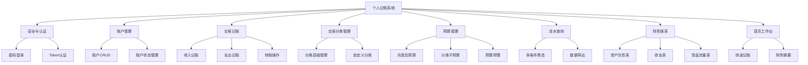
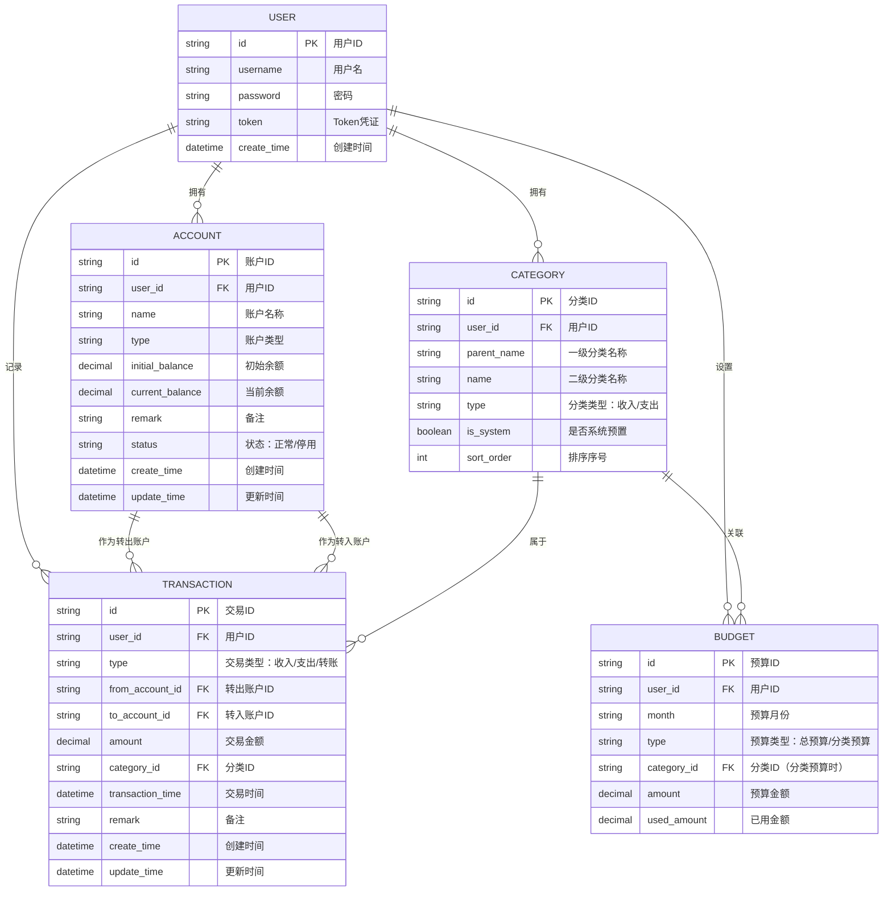
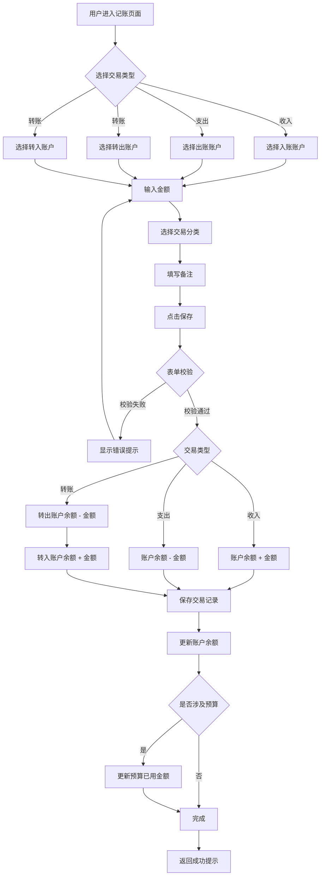
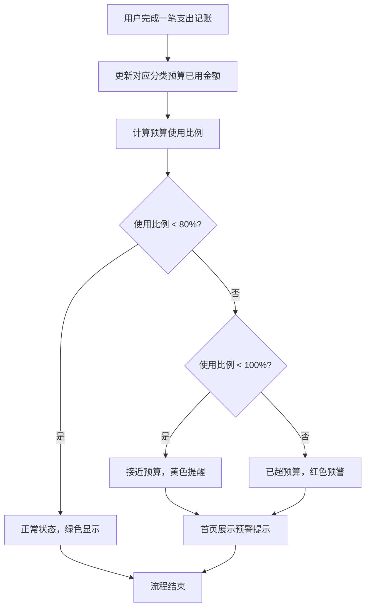
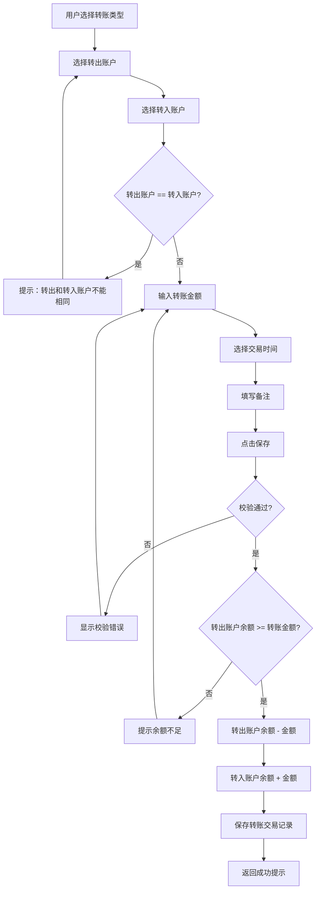
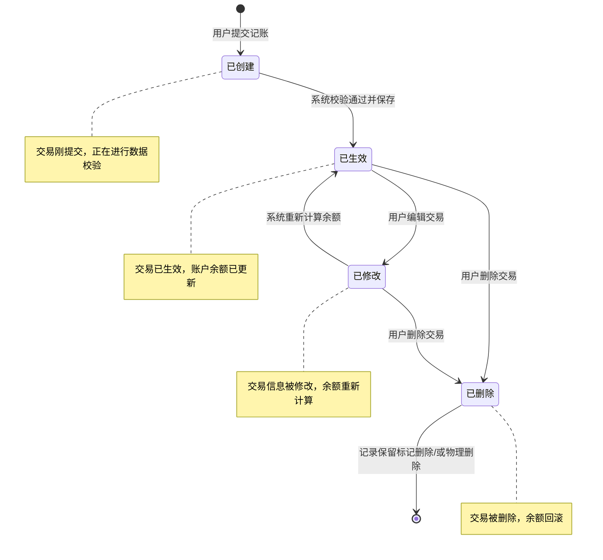
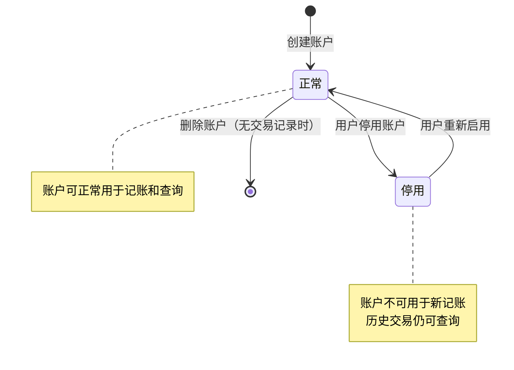

# 个人记账系统产品需求文档

> 文档版本：v1.0
> 适用范围：第一期前后端分离管理系统（单人使用，无权限系统）

---

## 1. 产品概述

### 1.1 产品定位

个人记账系统是一款面向个人用户的财务管理工具，帮助用户记录日常收支、管理个人资产、制定并跟踪预算计划，通过可视化报表直观了解个人财务状况，从而培养良好的理财习惯。

### 1.2 目标用户

| 用户画像 | 特征描述                                                     |
| -------- | ------------------------------------------------------------ |
| 核心用户 | 20-40岁有记账需求的个人用户，希望清晰掌握个人收支情况        |
| 使用场景 | 日常消费后随手记账、月末查看消费分析、制定月度预算并监控执行 |
| 技术能力 | 具备基础电脑操作能力，习惯使用 Web 端管理工具                |

### 1.3 核心价值

- **便捷记账**：快速记录收入、支出和转账交易，降低记账门槛
- **资产可视**：统一管理多账户资产，实时掌握总资产状况
- **预算管控**：设置月度预算并实时监控，超支自动预警提醒
- **数据洞察**：通过多维度报表分析消费结构和财务健康度

---

## 2. 功能模块总览

---

## 3. 功能模块详细需求

### 3.1 安全与认证模块

#### 3.1.1 用户登录

| 项目               | 说明                                                                                                                                               |
| ------------------ | -------------------------------------------------------------------------------------------------------------------------------------------------- |
| **功能描述** | 用户通过密码登录系统，验证通过后获取访问凭证                                                                                                       |
| **用户操作** | 1. 进入登录页面` `2. 输入用户名/密码` `3. 点击登录按钮                                                                                   |
| **预期结果** | 验证成功：进入系统首页，获取有效 Token` `验证失败：提示"用户名或密码错误"                                                                     |
| **异常处理** | - 用户名或密码为空：前端拦截并提示必填` `- 用户名或密码错误：提示登录失败，不透露具体哪个字段错误` `- 网络异常：提示网络错误，请稍后重试 |

#### 3.1.2 Token认证机制

| 项目               | 说明                                                                                             |
| ------------------ | ------------------------------------------------------------------------------------------------ |
| **功能描述** | 用户登录成功后，系统颁发加密 Token，后续所有请求携带 Token 进行身份认证                          |
| **用户操作** | 登录成功后系统自动处理，用户无感知                                                               |
| **预期结果** | - Token 有效期内可正常访问系统功能` `- Token 失效后自动跳转登录页                           |
| **异常处理** | - Token 过期：返回认证失效状态，前端自动跳转登录页面` `- Token 无效：拒绝请求并提示重新登录 |

#### 3.1.3 字段信息

| 字段名称 | 类型   | 必填 | 规则说明                             |
| -------- | ------ | ---- | ------------------------------------ |
| 用户名   | 字符串 | 是   | 长度3-20位，支持字母、数字、下划线   |
| 密码     | 字符串 | 是   | 长度6-20位，支持字母、数字、特殊字符 |
| Token    | 字符串 | -    | 系统自动生成，设置有效期限           |

---

### 3.2 账户管理模块

#### 3.2.1 账户新增

| 项目               | 说明                                                                                                                       |
| ------------------ | -------------------------------------------------------------------------------------------------------------------------- |
| **功能描述** | 用户可以创建新的资产账户，用于归集和管理不同渠道的资金                                                                     |
| **用户操作** | 1. 进入账户管理页面` `2. 点击"新增账户"按钮` `3. 填写账户信息（名称、类型、初始余额、备注）` `4. 点击保存   |
| **预期结果** | 账户创建成功，账户列表中显示新账户，当前余额等于初始余额                                                                   |
| **异常处理** | - 账户名称重复：提示"账户名称已存在"` `- 必填项未填：前端拦截提示` `- 初始余额格式错误：提示请输入有效的金额数字 |

#### 3.2.2 账户编辑

| 项目               | 说明                                                                                                     |
| ------------------ | -------------------------------------------------------------------------------------------------------- |
| **功能描述** | 修改已有账户的基本信息                                                                                   |
| **用户操作** | 1. 在账户列表中选择目标账户` `2. 点击"编辑"按钮` `3. 修改账户信息` `4. 点击保存           |
| **预期结果** | 账户信息更新成功，列表同步刷新                                                                           |
| **异常处理** | - 修改后名称与其他账户重复：提示重复错误` `- 仅允许修改名称和备注，账户类型和当前余额不允许直接修改 |

#### 3.2.3 账户删除

| 项目               | 说明                                                                                                         |
| ------------------ | ------------------------------------------------------------------------------------------------------------ |
| **功能描述** | 删除不再使用的账户                                                                                           |
| **用户操作** | 1. 在账户列表中选择目标账户` `2. 点击"删除"按钮` `3. 确认删除操作                                  |
| **预期结果** | 无关联交易的账户可直接删除；有关联交易的账户不允许物理删除                                                   |
| **异常处理** | - 账户存在交易记录：提示"该账户存在交易记录，不允许删除"` `- 系统预设基础账户：提示"系统账户不允许删除" |

#### 3.2.4 账户停用/启用

| 项目               | 说明                                                                       |
| ------------------ | -------------------------------------------------------------------------- |
| **功能描述** | 对暂时不使用的账户进行停用，停用后不再显示在记账选择列表中，但保留历史数据 |
| **用户操作** | 1. 在账户列表中选择目标账户` `2. 点击"停用"按钮` `3. 确认操作    |
| **预期结果** | 账户状态变为"停用"，记账时不再显示该账户                                   |
| **异常处理** | - 停用后不可用于新增交易，但不影响历史交易的查询和展示                     |

#### 3.2.5 字段信息

| 字段名称 | 类型     | 必填         | 规则说明                                     |
| -------- | -------- | ------------ | -------------------------------------------- |
| 账户ID   | 字符串   | 系统生成     | 唯一标识，不可修改                           |
| 账户名称 | 字符串   | 是           | 长度2-30位，同一用户下不可重复               |
| 账户类型 | 枚举     | 是           | 现金、银行储蓄卡、信用卡、支付宝、微信       |
| 初始余额 | 金额     | 是           | 精确到小数点后两位，可正可负（信用卡可为负） |
| 当前余额 | 金额     | 系统自动计算 | 根据初始余额和交易记录自动计算，不可直接修改 |
| 备注     | 字符串   | 否           | 长度0-200位                                  |
| 状态     | 枚举     | 是           | 正常 / 停用                                  |
| 创建时间 | 日期时间 | 系统自动生成 | 创建时自动记录                               |
| 更新时间 | 日期时间 | 系统自动更新 | 修改时自动更新                               |

---

### 3.3 交易记账模块

#### 3.3.1 收入记账

| 项目               | 说明                                                                                                                                                                          |
| ------------------ | ----------------------------------------------------------------------------------------------------------------------------------------------------------------------------- |
| **功能描述** | 记录一笔收入交易，增加目标账户余额                                                                                                                                            |
| **用户操作** | 1. 选择交易类型为"收入"` `2. 选择入账账户` `3. 输入金额` `4. 选择交易分类` `5. 选择交易时间（默认当前时间）` `6. 填写备注（可选）` `7. 点击保存 |
| **预期结果** | 交易记录创建成功，对应账户当前余额增加相应金额                                                                                                                                |
| **异常处理** | - 未选择账户：提示"请选择入账账户"` `- 金额小于等于0：提示"收入金额必须大于0"` `- 账户已停用：提示"该账户已停用，请选择其他账户"                                    |

#### 3.3.2 支出记账

| 项目               | 说明                                                                                                                                                                          |
| ------------------ | ----------------------------------------------------------------------------------------------------------------------------------------------------------------------------- |
| **功能描述** | 记录一笔支出交易，减少目标账户余额                                                                                                                                            |
| **用户操作** | 1. 选择交易类型为"支出"` `2. 选择出账账户` `3. 输入金额` `4. 选择交易分类` `5. 选择交易时间（默认当前时间）` `6. 填写备注（可选）` `7. 点击保存 |
| **预期结果** | 交易记录创建成功，对应账户当前余额减少相应金额                                                                                                                                |
| **异常处理** | - 余额不足：提示"账户余额不足，确认继续？"（用户可确认超支记账）` `- 金额小于等于0：提示"支出金额必须大于0"                                                              |

#### 3.3.3 转账记账

| 项目               | 说明                                                                                                                                                                              |
| ------------------ | --------------------------------------------------------------------------------------------------------------------------------------------------------------------------------- |
| **功能描述** | 记录一笔从一个账户到另一个账户的转账交易，转出账户余额减少，转入账户余额增加，转账金额一致                                                                                        |
| **用户操作** | 1. 选择交易类型为"转账"` `2. 选择转出账户` `3. 选择转入账户` `4. 输入转账金额` `5. 选择交易时间（默认当前时间）` `6. 填写备注（可选）` `7. 点击保存 |
| **预期结果** | 交易记录创建成功，转出账户余额减少，转入账户余额增加，两账户变动金额一致                                                                                                          |
| **异常处理** | - 转出与转入账户相同：提示"转出账户和转入账户不能相同"` `- 转出账户余额不足：提示余额不足` `- 任一账户已停用：提示"账户已停用，请选择其他账户"                          |

#### 3.3.4 交易编辑

| 项目               | 说明                                                                                                       |
| ------------------ | ---------------------------------------------------------------------------------------------------------- |
| **功能描述** | 修改已记录的交易信息，修改后自动重新计算相关账户余额                                                       |
| **用户操作** | 1. 在交易列表中找到目标交易` `2. 点击"编辑"按钮` `3. 修改交易信息` `4. 点击保存             |
| **预期结果** | 交易信息更新，原账户和新账户（如涉及）余额重新计算                                                         |
| **异常处理** | - 不允许修改交易类型（收入/支出/转账之间不可互转）` `- 修改金额后余额计算出现负数：给出提示但允许保存 |

#### 3.3.5 交易删除

| 项目               | 说明                                                                        |
| ------------------ | --------------------------------------------------------------------------- |
| **功能描述** | 删除错误的交易记录，删除后自动恢复账户原余额                                |
| **用户操作** | 1. 在交易列表中找到目标交易` `2. 点击"删除"按钮` `3. 确认删除操作 |
| **预期结果** | 交易记录删除，相关账户余额回滚到交易前状态                                  |
| **异常处理** | - 删除后账户余额出现负数：给出提示但允许删除                                |

#### 3.3.6 字段信息

| 字段名称 | 类型     | 必填         | 规则说明                                     |
| -------- | -------- | ------------ | -------------------------------------------- |
| 交易ID   | 字符串   | 系统生成     | 唯一标识                                     |
| 交易类型 | 枚举     | 是           | 收入 / 支出 / 转账                           |
| 交易账户 | 引用     | 是           | 收入/支出：单个账户；转账：转出账户+转入账户 |
| 交易金额 | 金额     | 是           | 精确到小数点后两位，必须大于0                |
| 交易分类 | 引用     | 是           | 关联交易分类（两级分类）                     |
| 交易时间 | 日期时间 | 是           | 精确到分钟，默认当前时间                     |
| 备注     | 字符串   | 否           | 长度0-500位                                  |
| 创建时间 | 日期时间 | 系统自动生成 | 记录创建时间                                 |
| 更新时间 | 日期时间 | 系统自动更新 | 记录最后修改时间                             |

---

### 3.4 交易分类管理模块

#### 3.4.1 分类体系

| 项目               | 说明                                                                                                   |
| ------------------ | ------------------------------------------------------------------------------------------------------ |
| **功能描述** | 系统采用两级分类结构，第一级为大类（如"餐饮"），第二级为子类（如"外卖"、"堂食"），便于精细化统计和分析 |
| **用户操作** | 系统预置常用分类，用户可自定义增删改                                                                   |
| **预期结果** | 分类层级清晰，记账时可快速选择到具体子分类                                                             |
| **异常处理** | - 删除分类时若存在关联交易：提示"该分类下存在交易记录，不允许删除"                                     |

#### 3.4.2 系统预置分类

系统预置以下常用分类供用户直接使用：

| 一级分类 | 二级分类                                 |
| -------- | ---------------------------------------- |
| 餐饮     | 外卖、堂食、食材、零食饮料               |
| 交通     | 公共交通、打车、加油、停车               |
| 购物     | 服饰鞋包、日用百货、数码电子             |
| 居住     | 房租、水电煤、物业、维修                 |
| 娱乐     | 电影演出、游戏、旅游、会员订阅           |
| 医疗     | 药品、诊疗、体检                         |
| 教育     | 书籍、课程培训、考试                     |
| 收入     | 工资、奖金、投资收益、兼职、红包         |
| 转账     | 账户间转账（系统内部使用，不展示给用户） |

#### 3.4.3 自定义分类管理

| 项目               | 说明                                                                                                                                                                                                    |
| ------------------ | ------------------------------------------------------------------------------------------------------------------------------------------------------------------------------------------------------- |
| **功能描述** | 用户可根据个人需求添加、修改、删除自定义分类                                                                                                                                                            |
| **用户操作** | **新增**：点击"新增分类" → 选择/输入一级分类 → 输入二级分类名称 → 保存` `**修改**：选择分类 → 点击编辑 → 修改名称 → 保存` `**删除**：选择分类 → 点击删除 → 确认删除 |
| **预期结果** | 自定义分类实时生效，可在记账时选择使用                                                                                                                                                                  |
| **异常处理** | - 同一级分类下二级分类名称重复：提示"该分类下已存在同名子分类"` `- 系统预置分类不允许删除，仅允许自定义分类删除` `- 删除分类前校验是否有关联交易                                              |

#### 3.4.4 字段信息

| 字段名称     | 类型   | 必填         | 规则说明                                    |
| ------------ | ------ | ------------ | ------------------------------------------- |
| 分类ID       | 字符串 | 系统生成     | 唯一标识                                    |
| 一级分类名称 | 字符串 | 是           | 长度2-20位                                  |
| 二级分类名称 | 字符串 | 是           | 长度2-20位                                  |
| 分类类型     | 枚举   | 是           | 收入 / 支出（用于区分该分类适用的交易类型） |
| 是否系统预置 | 布尔   | 系统自动标记 | true=系统预置，false=用户自定义             |
| 排序序号     | 整数   | 否           | 控制分类展示顺序                            |

---

### 3.5 预算管理模块

#### 3.5.1 月度总预算设置

| 项目               | 说明                                                                                           |
| ------------------ | ---------------------------------------------------------------------------------------------- |
| **功能描述** | 用户为每个月设置总支出预算上限，作为整体消费控制目标                                           |
| **用户操作** | 1. 进入预算管理页面` `2. 选择目标月份` `3. 输入月度总预算金额` `4. 点击保存     |
| **预期结果** | 该月份总预算设置成功，首页和预算页面展示预算执行进度                                           |
| **异常处理** | - 预算金额小于等于0：提示"预算金额必须大于0"` `- 月份重复设置：覆盖原有预算金额并提示确认 |

#### 3.5.2 分类子预算设置

| 项目               | 说明                                                                                         |
| ------------------ | -------------------------------------------------------------------------------------------- |
| **功能描述** | 在总预算基础上，为各支出分类设置子预算，实现精细化预算管控                                   |
| **用户操作** | 1. 在预算管理页面展开分类预算设置` `2. 为各一级分类输入预算金额` `3. 点击保存      |
| **预期结果** | 各分类预算设置成功，分类预算之和可等于或小于总预算                                           |
| **异常处理** | - 分类预算之和超过总预算：给出黄色警告提示"分类预算总和超过月度总预算"（允许保存，仅作提示） |

#### 3.5.3 预算执行监控与预警

| 项目               | 说明                                                                                                                                                            |
| ------------------ | --------------------------------------------------------------------------------------------------------------------------------------------------------------- |
| **功能描述** | 系统实时监控预算执行情况，根据消耗比例进行分级提醒                                                                                                              |
| **用户操作** | 用户记账后系统自动计算，用户可在预算页面查看进度                                                                                                                |
| **预期结果** | - 预算消耗 < 80%：正常展示，绿色进度条` `- 预算消耗 >= 80% 且 < 100%：黄色提醒，显示"已接近预算上限"` `- 预算消耗 >= 100%：红色预警，显示"已超出预算" |
| **异常处理** | - 未设置预算的月份：显示"未设置预算"提示，引导用户设置                                                                                                          |

#### 3.5.4 预算占比分析

| 项目               | 说明                                                              |
| ------------------ | ----------------------------------------------------------------- |
| **功能描述** | 展示各分类预算在总预算中的占比分布，帮助用户了解预算分配结构      |
| **用户操作** | 在预算管理页面查看预算占比图表                                    |
| **预期结果** | 以饼图/环形图形式展示各分类预算占比，同时显示实际支出占比进行对比 |
| **异常处理** | - 未设置分类预算时：饼图显示"未设置分类预算"占位提示              |

#### 3.5.5 字段信息

| 字段名称 | 类型   | 必填         | 规则说明                      |
| -------- | ------ | ------------ | ----------------------------- |
| 预算ID   | 字符串 | 系统生成     | 唯一标识                      |
| 预算月份 | 字符串 | 是           | 格式：yyyy-MM，如 2026-05     |
| 预算类型 | 枚举   | 是           | 总预算 / 分类预算             |
| 关联分类 | 引用   | 分类预算必填 | 关联一级分类，总预算此项为空  |
| 预算金额 | 金额   | 是           | 精确到小数点后两位，必须大于0 |
| 已用金额 | 金额   | 系统自动计算 | 根据当月实际支出自动汇总      |
| 剩余金额 | 金额   | 系统自动计算 | 预算金额 - 已用金额           |
| 使用比例 | 百分比 | 系统自动计算 | 已用金额 / 预算金额 × 100%   |

---

### 3.6 流水查询模块

#### 3.6.1 多条件组合查询

| 项目               | 说明                                                                                         |
| ------------------ | -------------------------------------------------------------------------------------------- |
| **功能描述** | 用户可通过多种条件组合筛选交易记录，快速定位目标流水                                         |
| **用户操作** | 1. 进入流水查询页面` `2. 设置查询条件（可单选或多选组合）` `3. 点击查询按钮        |
| **预期结果** | 列表展示符合所有条件的交易记录，默认按交易时间倒序排列                                       |
| **异常处理** | - 查询结果为空：显示"未找到符合条件的记录"` `- 时间范围超过合理区间：给出提示但允许查询 |

#### 3.6.2 查询条件

| 查询条件 | 说明                      | 示例                    |
| -------- | ------------------------- | ----------------------- |
| 时间范围 | 开始日期 ~ 结束日期       | 2026-05-01 ~ 2026-05-31 |
| 交易类型 | 多选：收入 / 支出 / 转账  | 支出                    |
| 交易账户 | 多选：具体账户            | 招商银行储蓄卡、支付宝  |
| 交易分类 | 选择一级分类和/或二级分类 | 餐饮 > 外卖             |
| 金额范围 | 最小金额 ~ 最大金额       | 10.00 ~ 500.00          |
| 关键词   | 模糊匹配备注内容          | "咖啡"                  |

#### 3.6.3 列表展示

| 项目               | 说明                                               |
| ------------------ | -------------------------------------------------- |
| **功能描述** | 以表格形式展示交易记录，支持排序和分页             |
| **用户操作** | 查看列表，点击列头排序，切换分页                   |
| **预期结果** | 列表默认按交易时间倒序排列，分页展示，每页默认20条 |
| **异常处理** | - 数据量大时采用分页加载，避免一次性加载过多数据   |

列表展示字段：

| 展示字段 | 说明                                                |
| -------- | --------------------------------------------------- |
| 交易时间 | 精确到分钟                                          |
| 交易类型 | 收入（绿色）、支出（红色）、转账（蓝色）            |
| 交易分类 | 一级分类 > 二级分类                                 |
| 账户     | 收入/支出显示单账户，转账显示"转出账户 → 转入账户" |
| 金额     | 收入显示 +，支出显示 -，转账显示金额和方向          |
| 备注     | 备注内容，为空显示"-"                               |
| 操作     | 编辑、删除按钮                                      |

#### 3.6.4 数据导出

| 项目               | 说明                                                                                                    |
| ------------------ | ------------------------------------------------------------------------------------------------------- |
| **功能描述** | 将当前筛选条件下的交易记录导出为 Excel 或 PDF 文件                                                      |
| **用户操作** | 1. 设置查询条件并查询` `2. 点击"导出"按钮` `3. 选择导出格式（Excel / PDF）` `4. 确认导出 |
| **预期结果** | 系统生成并下载对应格式的文件，文件内容与当前筛选结果一致                                                |
| **异常处理** | - 无筛选结果时：提示"没有可导出的数据"` `- 导出数据量过大：给出进度提示或分批导出                  |

---

### 3.7 财务报表模块

#### 3.7.1 报表通用规则

| 项目               | 说明                                                                                   |
| ------------------ | -------------------------------------------------------------------------------------- |
| **统计维度** | 以自然月为最小统计维度，用户可选择查看指定月份                                         |
| **报表形式** | 数据表格 + 可视化图表（饼图/柱状图/折线图）组合展示                                    |
| **用户操作** | 1. 进入报表页面` `2. 选择报表类型` `3. 选择目标月份` `4. 查看数据和图表 |

#### 3.7.2 资产负债表

| 项目               | 说明                                                                 |
| ------------------ | -------------------------------------------------------------------- |
| **功能描述** | 展示某一时点用户的资产分布情况，反映个人财务实力                     |
| **核心公式** | 总资产 = 各账户当前余额之和（仅含储蓄类正向资产）                    |
| **数据内容** | - 按账户类型分组汇总` `- 各账户明细列表（名称、类型、当前余额） |
| **可视化**   | 饼图：各账户类型资产占比分布                                         |

#### 3.7.3 收支表（利润表）

| 项目               | 说明                                                                                                                   |
| ------------------ | ---------------------------------------------------------------------------------------------------------------------- |
| **功能描述** | 展示某一月份的收入、支出及结余情况，反映当期财务成果                                                                   |
| **核心公式** | 结余 = 总收入 - 总支出                                                                                                 |
| **数据内容** | - 收入汇总：按分类汇总各收入来源金额` `- 支出汇总：按分类汇总各支出去向金额` `- 总计行：总收入、总支出、结余 |
| **可视化**   | - 柱状图：收入 vs 支出对比` `- 饼图：支出分类占比分布                                                             |

#### 3.7.4 现金流量表

| 项目               | 说明                                                                                                                                     |
| ------------------ | ---------------------------------------------------------------------------------------------------------------------------------------- |
| **功能描述** | 展示某一月份各账户的资金流入、流出及净流量情况                                                                                           |
| **核心公式** | 净流量 = 流入总额 - 流出总额                                                                                                             |
| **数据内容** | - 按账户展示：期初余额、本期流入、本期流出、净流量、期末余额` `- 流入来源分析（收入分类占比）` `- 流出去向分析（支出分类占比） |
| **可视化**   | - 柱状图：各账户流入/流出/净流量对比` `- 折线图：可选多月份展示余额变动趋势                                                         |

---

### 3.8 首页（工作台）模块

#### 3.8.1 页面布局

首页采用左右分栏布局：

| 区域 | 宽度占比 | 内容         |
| ---- | -------- | ------------ |
| 左侧 | 约40%    | 快速记账入口 |
| 右侧 | 约60%    | 财务摘要看板 |

#### 3.8.2 快速记账

| 项目               | 说明                                                                                                                  |
| ------------------ | --------------------------------------------------------------------------------------------------------------------- |
| **功能描述** | 在首页左侧提供快捷的记账入口，减少用户操作步骤                                                                        |
| **用户操作** | 1. 选择交易类型（收入/支出/转账）` `2. 选择账户` `3. 输入金额` `4. 选择分类` `5. 点击"记一笔"按钮 |
| **预期结果** | 快速完成记账，右侧摘要数据实时刷新                                                                                    |
| **异常处理** | - 必填项未填：前端实时校验提示                                                                                        |

#### 3.8.3 财务摘要看板

| 项目               | 说明                                                     |
| ------------------ | -------------------------------------------------------- |
| **功能描述** | 在首页右侧展示今日、本周、本月三个时间维度的财务摘要数据 |
| **用户操作** | 用户进入首页自动展示，无需操作                           |
| **预期结果** | 数据实时计算并展示                                       |

摘要看板内容：

| 统计维度       | 展示指标                                                 |
| -------------- | -------------------------------------------------------- |
| **今日** | 今日收入、今日支出、今日笔数                             |
| **本周** | 本周收入、本周支出、本周笔数、日均支出                   |
| **本月** | 本月收入、本月支出、本月结余、预算执行率（如有设置预算） |

#### 3.8.4 预算执行提醒

| 项目               | 说明                                                                                                                |
| ------------------ | ------------------------------------------------------------------------------------------------------------------- |
| **功能描述** | 在首页顶部或摘要区域展示当月预算执行状态提醒                                                                        |
| **用户操作** | 自动展示                                                                                                            |
| **预期结果** | - 未超预算：展示剩余预算金额和进度条` `- 接近预算（>=80%）：黄色提醒` `- 已超预算（>=100%）：红色预警提示 |

---

## 4. 数据关系图（ER图）

---

## 5. 核心业务流程图

### 5.1 记账流程

### 5.2 预算预警流程

### 5.3 转账流程

---

## 6. 状态流转图

### 6.1 交易状态流转

### 6.2 账户状态流转

---

## 7. 非功能性需求

### 7.1 安全性需求

| 需求编号 | 需求描述                                                | 优先级 |
| -------- | ------------------------------------------------------- | ------ |
| SEC-001  | 用户密码必须加密存储，禁止明文保存                      | 高     |
| SEC-002  | 系统使用 Token 认证机制，所有业务请求必须携带有效 Token | 高     |
| SEC-003  | Token 应设置合理的过期时间，过期后自动失效              | 高     |
| SEC-004  | 敏感数据传输过程应进行加密保护                          | 中     |
| SEC-005  | 系统应具备基础的防暴力破解机制（如登录失败次数限制）    | 中     |

### 7.2 易用性需求

| 需求编号 | 需求描述                                   | 优先级 |
| -------- | ------------------------------------------ | ------ |
| USR-001  | 记账操作应在3步以内完成核心信息录入        | 高     |
| USR-002  | 所有金额输入和展示统一保留两位小数         | 高     |
| USR-003  | 日期选择器默认定位到当前日期，减少用户操作 | 中     |
| USR-004  | 表单提交前应进行前端校验，及时反馈错误信息 | 高     |
| USR-005  | 关键操作（删除、大额支出）应有二次确认提示 | 中     |
| USR-006  | 页面响应时间不超过2秒，操作无卡顿感        | 高     |
| USR-007  | 系统提供清晰的操作引导和空状态提示         | 中     |

### 7.3 数据完整性需求

| 需求编号 | 需求描述                                                         | 优先级 |
| -------- | ---------------------------------------------------------------- | ------ |
| DTI-001  | 交易记录与账户余额应始终保持一致，任何交易变动都应准确反映到余额 | 高     |
| DTI-002  | 转账操作必须保证转出账户减少和转入账户增加的金额完全一致         | 高     |
| DTI-003  | 交易记录删除后，相关账户余额应准确回滚到交易前状态               | 高     |
| DTI-004  | 交易记录编辑后，原账户和新账户的余额应重新准确计算               | 高     |
| DTI-005  | 分类删除前必须校验是否有关联交易，防止数据孤立                   | 中     |

### 7.4 可维护性需求

| 需求编号 | 需求描述                                     | 优先级 |
| -------- | -------------------------------------------- | ------ |
| MTN-001  | 系统应支持数据备份和恢复机制                 | 中     |
| MTN-002  | 系统操作日志应记录关键业务操作，便于问题追溯 | 中     |
| MTN-003  | 系统预置分类应可扩展，便于后续增加新分类     | 低     |

### 7.5 性能需求

| 需求编号 | 需求描述                                        | 优先级 |
| -------- | ----------------------------------------------- | ------ |
| PRF-001  | 首页加载时间不超过2秒                           | 高     |
| PRF-002  | 流水查询响应时间不超过3秒（单用户数据量下）     | 高     |
| PRF-003  | 报表生成响应时间不超过5秒                       | 中     |
| PRF-004  | 系统应支持至少5年的数据存储和查询性能不显著下降 | 中     |

---

## 附录

### A. 术语表

| 术语       | 说明                                                               |
| ---------- | ------------------------------------------------------------------ |
| 单式记账   | 每笔交易只在一个账户中记录增加或减少                               |
| 资产负债表 | 反映某一时点资产分布状况的报表                                     |
| 收支表     | 反映某一期间收入、支出及结余情况的报表（个人记账场景下的"利润表"） |
| 现金流量表 | 反映某一期间各账户资金流入流出情况的报表                           |
| Token      | 用户登录后系统颁发的加密凭证，用于身份认证                         |

### B. 修订记录

| 版本 | 日期       | 修订内容 | 修订人 |
| ---- | ---------- | -------- | ------ |
| v1.0 | 2026-05-05 | 初始版本 | -      |
